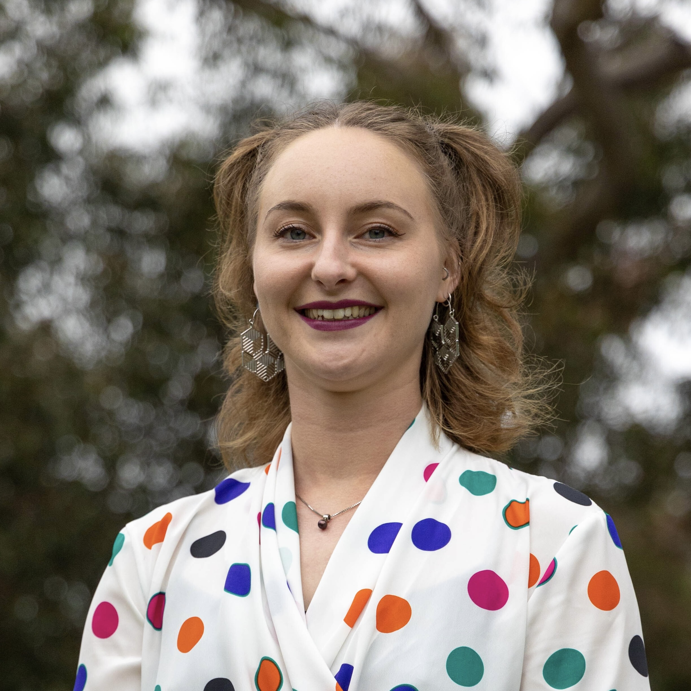
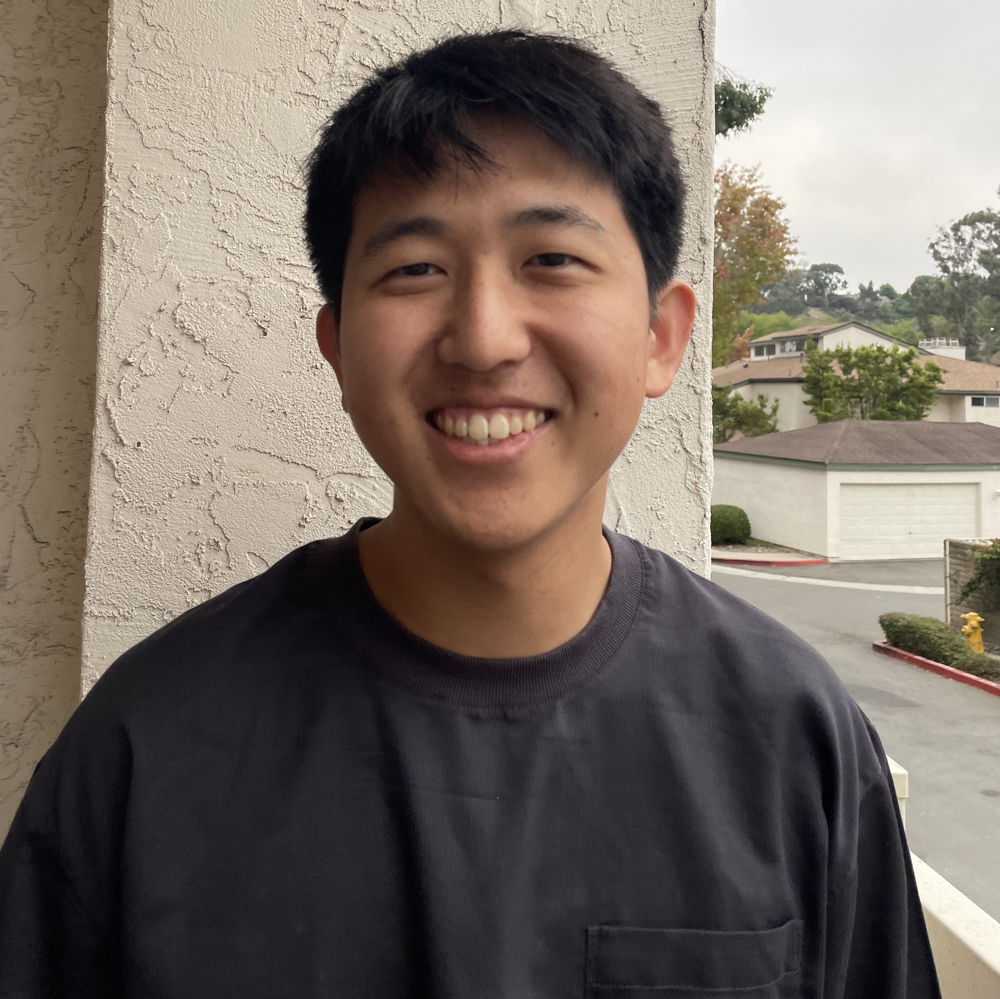

# Welcome to COGS 137!

Practical Data Science in R

Please take one [green]{.sticky-green} sticky and one [pink]{.sticky-pink} sticky as they come around. If you're able, try and save these. We'll use them most classes. (But, I'll always have extra!)

```{r echo=FALSE, message=FALSE, warning=FALSE}
library(tidyverse)
library(googlesheets4)
library(emo)

# Set dpi and height for images
knitr::opts_chunk$set(fig.height = 2.65, dpi = 300, echo=TRUE) 
htmltools::tagList(rmarkdown::html_dependency_font_awesome())

options(gargle_oauth_email = "sellis@ucsd.edu")
```

## Agenda

1.  Describe what this class is
2.  Describe how the class will run
3.  Preview the tools we'll use (more on Monday!)

## What is R?

<i class="fa fa-code fa"></i> : R is a statistical programming language.

While R has most/all of the functionality of **YFPL** (your favorite programming language), it was designed for the specific use of analyzing data.

## What is data science?

<i class="fa fa-laptop fa-lg"></i>: Data science is the scientific process of using data to answer interesting questions and/or solve important problems.

## Practical Data Science in R

::: incremental
-   Program at the introductory level in the R statistical programming language
-   Employ the tidyverse suite of packages to interact with, wrangle, visualize, and model data
-   Explain & apply statistical concepts (estimation, linear regression, logistic regression, etc.) for data analysis
-   Communicate data science projects through effective visualization, oral presentation, and written reports
:::

## Who am I?

Shannon Ellis: Associate Teaching Professor, Mom & wife, volleyball-obsessed, and baking & cooking lover

<i class="fa fa-envelope"></i>   [sellis\@ucsd.edu](mailto:sellis@ucsd.edu) <br> <i class="fa fa-home"></i>   [shannon-ellis.com](https://shannon-ellis.com/) <br> <i class="fa fa-university"></i>  CSB 002 <br> <i class="fa fa-calendar"></i>   Tu/Th 2-3:20PM (Lab: Fri 2-2:50 (RWAC 0103) or Mon 5-5:50 (DIB 121))

## Course Staff

| Quirine (Q) van-Engen (TA) | Eric Song     (IA) |
|-----------------------------|----------|
|         |     |

## What is this course? {.scrollable}

Everything you want to know about the course, and everything you will need for the course will be posted at: <https://cogs137-fa26.github.io/cogs137-fa26/>

::: incremental
-   Is this an intro CS course? No.
-   Will we be doing computing? Yes.
-   What computing language will we learn? R.
-   Is this an intro stats course? No.
-   Will we be doing stats? Yes.
-   Are there any prerequisites? Yes, an intro statistics course!
:::

## So...I don't have to know how to program already?

::: columns
::: {.column width="40%"}

:::

::: {.column width="60%"}
Nope! The first few weeks of the course will be all about getting **comfortable using the R programming language**!

<br/> After that, we'll focus on delving into interesting statistical analyses through **case studies**.
:::
:::

::: footer
Artwork by [\@allison_horst](https://github.com/allisonhorst/stats-illustrations/) <a href="https://twitter.com/allison_horst" title="allison_horst"><i class="fa fa-twitter"></i></a>
:::

# Course Structure and Policies {background-color="#92A86A"}

## The General Plan

-   Learn R & the tidyverse
-   Use interesting case studies to do so
-   Do a project for your portfolio
-   w/ a focus on communication and group work

. . .

Note: This course has historically been back-loaded, as that's when group work has happened historically. I've tried to fix that this quarter by teaching from case studies from the beginning.

## The Nitty Gritty {.scrollable}

::: panel-tabset
### Lecture

**Class Meetings**

-   Interactive
-   Lectures & lots of learn-by-doing
-   Bring your laptop to class every day

### In-person

**In-person, synchronous learning**

1.  I will be teaching in person.
2.  Lectures and lab will be podcast.
3.  Attendance will be incentivized using a daily participation survey.
4.  If you're not feeling well, please stay home. I will do the same.

### Waitlist

**The (Dreaded) Waitlist**

-   Course enrollment is supposed to be 70 for this course
-   There are 100 people currently enrolled
-   I don't control the waitlist (cogsadvising\@ucsd.edu does)
-   I don't anticipate students being enrolled off of the waitlist (will be dependent on students dropping)

### Lab & OH

**Lab & Office Hours**

-   **Office hours** begin Friday** week 1
    -   Prof: Tu: 11A-12P (drop-in); W 10-11A (10 min slots; appt.)
-   **Lab** begins week 1 (next **Thursday**, 10/1)
    -   it's *not* in a computer lab, so you'll need to bring your own
    -   details about labs covered on Monday and in lab
    -   labs are released on Thursday and due the following Friday
-   I will hang out after class today for questions/concerns from students

### Materials

**Course Materials**

-   Textbooks are free and available online
-   Course platforms:
    -   Website : schedule, policies, due dates, etc.
    -   GitHub : retrieving assignments, labs, homework, etc.
    -   datahub : completing assignments, labs, homework, etc.
    -   Canvas : grades, course-specific links
    -   TBD : Q&A
:::

## Which Q&A Platform?

**Q**: Which Q&A Platform should we use this quarter? Discuss with your neighbor!  
</br>
**A**: Piazza, ClassQuestion, Slack, Canvas? Something else?  

Put a [green]{.sticky-green} sticky on the front of your computer when you're done discussing. Put a [pink]{.sticky-pink} if you have a question.

## Diversity & Inclusion:

**Goal**: every student be well-served by this course

. . .

**Philosophy:** The diversity of students in this class is a huge asset to our learning community; our differences provide opportunities for learning and understanding.

. . .

**Plan:** Present course materials that are conscious of and respectful to diversity (gender identity, sexuality, disability, age, socioeconomic status, ethnicity, race, nationality, religion, politics, and culture)

. . .

**But...** if I ever fall short or if you ever have suggestions for improvement, please do share with me! There is also an [anonymous Google Form](https://goo.gl/forms/2nXnDNbgYuS1OsGF2) if you're more comfortable there.

## A new-ish course! {.scrollable}

-   Offered 3x previously...but changes significantly each time
-   If something doesn't make sense, tell me!
-   If you've got feedback/suggestions, I'm all ears!


## Changes since last iteration

(based on feedback & recordings from last time):

- MWF (50 min) lectures, with more time for EDA and modeling
  - two days of CS02 EDA, two of regression, and a new "putting the model together" day
- a new lecture on **AI-assisted analysis** (using AI well & checking its work)
- Quarto (`.qmd`) for everything
- GitHub: your repos are created for you (no more assignment links)

## How to get help {.scrollable}

-   Lab
-   Office Hours
-   Q&A


## Q&A 

A few (Q&A) guidelines:

```         
1. No duplicates.
2. Public posts are best.
3. Posts should include your question, what you've tried so far, & resources used.
4. Helping others is encouraged.
5. No assignment code in public posts.
6. We're not robots.
```

##  The R Community


::: footnote
Artwork by [\@allison_horst](https://github.com/allisonhorst/stats-illustrations/) <a href="https://twitter.com/allison_horst" title="allison_horst"><i class="fa fa-twitter"></i></a>
:::

## Academic integrity

Don't cheat.

. . .

Teamwork is allowed, but you should be able to answer "Yes" to each of the following:

-   Can I explain each piece of code and each analysis carried out in what I'm submitting?
-   Could I reproduce this code/analysis on my own?

. . .

The Internet (including LLMS/ChatGPT) is a great resource. Cite your sources.

## When To (Can I) Use ChatGPT/LLMs?

For anything in this course.

## How To Use ChatGPT/LLMs

Probably never first or right away.

. . .

To learn: Think first. Try first. Then use external resources.

. . .

Always read/think about/understand the output.

## ChatGPT: What to Avoid

::: incremental
-   Over-reliance (thwarts learning)
-   Having to look *everything* up (wastes time)
-   Leaving tasks to the last minute (*can* lead to bad decisions/academic integrity issues)
-   Taking the output without thinking (thwarts learning; limits critical thinking practice)
-   Using it right away for brainstorming ideas (limits ideas generated)
:::

## Course components:

::: incremental
-   [Labs (7)]{.label-green}: Individual submission; graded on effort
-   [Homework (3)]{.label-green}: Individual submission; graded on correctness
-   [Case Studies (2)]{.label-green}: Team submission, technical analysis report + general communication
-   [Final Project (1)]{.label-green}: Team submission, due Fri of finals week (12/11) w/ checkpoints prior
:::

## Grading

Your final grade will be comprised of the following:

| Assignment (#)               | \% of grade     |
|------------------------------|-----------------|
| Labs (7)                     | 21% (3pt each)  |
| Homework (3)                 | 24% (8pt each)  |
| Case Study Projects\* (2)    | 30% (15pt each) |
| Final Project Proposal\* (1) | 3%              |
| Peer Review\* (1)            | 3%              |
| Final Report\* (1)           | 11%             |
| Final Presentation\* (1)     | 4%              |
| Team Evaluation Surveys (3)  | 3% (1pt each)   |

: \* indicates group submission

## Late/missed work policy

-   Homework and case study projects: accepted up to 3 days (72 hours) after the assigned deadline for a 25% deduction

-   No late deadlines for labs or the final project

. . .

Note: Prof Ellis is a reasonable person; reach out to her if you have an extenuating circumstance at any point in the quarter.

# Students {background-color="#92A86A"}

## Who's in this class?

```{r data, message=FALSE, warning=FALSE, echo=TRUE, eval=TRUE}
roster <- read_sheet('1ALPAaDU6-GEoxwq3Q5WMGsqvbFoCw4jGDuz0C_VtqqM')

ggplot(roster, aes(x = College)) +
  geom_bar() +
  labs(title = "COGS 137") +
  theme_bw(base_size = 14) + 
  theme(plot.title.position = "plot")
```

Note: This code will not run for you because you don't have access to the roster for this course.

## Who's in this class?

```{r major}
roster |>
  mutate(major = substr(Major, 1, 2)) |>
  ggplot(aes(fct_infreq(major))) + 
  geom_bar() +
  labs(title = "COGS 137",
       x = "Major") +
  theme_bw(base_size = 12) + 
  theme(plot.title.position = "plot")
```

## Who's in this class?

```{r year}
roster |>
  ggplot(aes(fct_relevel(Level, "JR", "SR", "VI"))) +
  geom_bar() +
  labs(title = "COGS 137",
       x = "Level") +
  theme_bw(base_size = 14) + 
  theme(plot.title.position = "plot")
```

## I'd like to know more!

(*required*)[Student Survey](https://docs.google.com/forms/d/e/1FAIpQLSfSLaJBNu-dm--yPhuzerS_DEHvsfhvkfqulrultVjRSlYcZA/viewform?usp=sf_link) - complete by Fri 10/2 at 11:59 PM.

**This is required and completion will be used for CAA/#finaid.** **DO** complete this even if you're on the waitlist, please.

. . .

(*optional*) [Daily Post-Lecture Feedback](https://docs.google.com/forms/d/e/1FAIpQLSebrcx8p0zG5YylzGoCFKRLPVW4wdHoTHIRNc8-YYi_wjleLg/viewform?usp=sf_link)

-   opportunity to reflect on learning
-   opportunity to ask questions (I will read & answer.)
-   opportunity for EC on final project

::: aside
Note: Links to both surveys are also on Canvas. I will *try* to remind you at the end of lecture, but I'll probably forget. Feel free to remind me/one another!
:::
