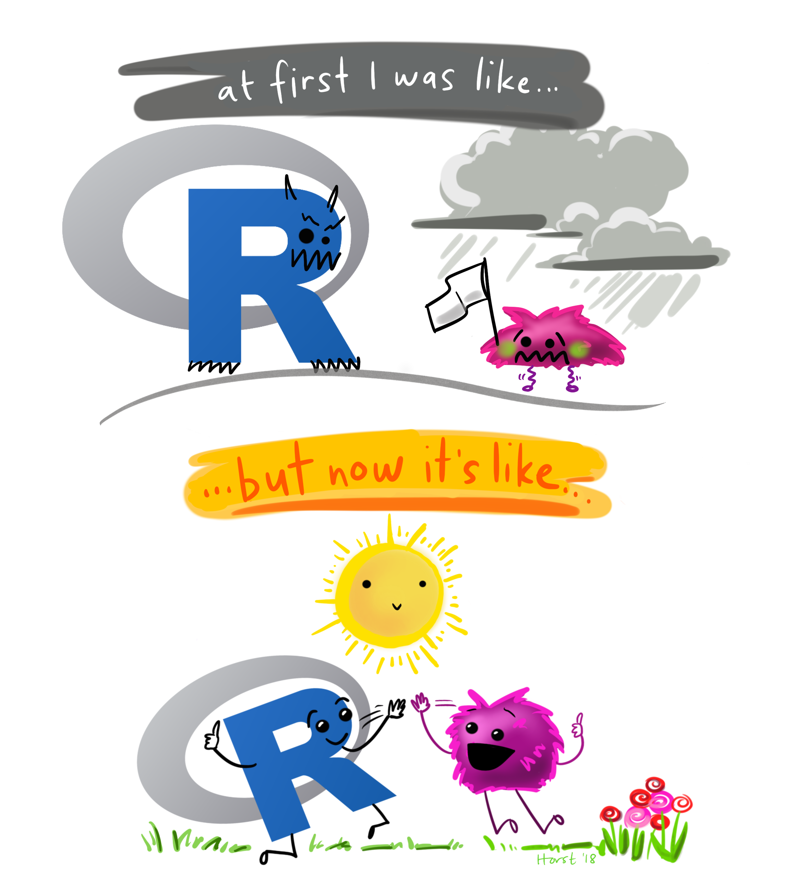
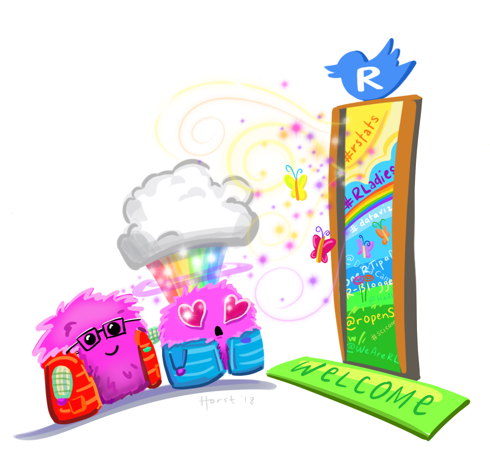
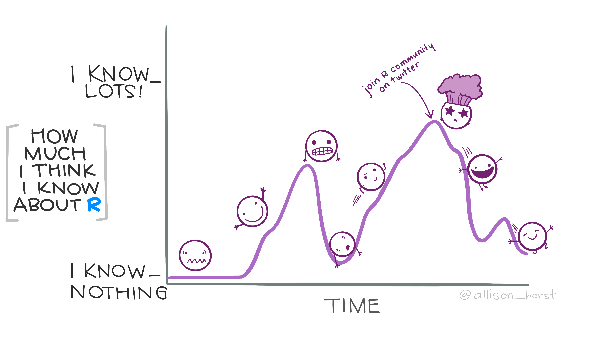

# Welcome to COGS 137!

Practical Data Science in R

```{r echo=FALSE, message=FALSE, warning=FALSE}
library(tidyverse)
library(googlesheets4)
library(emo)

# Set dpi and height for images
knitr::opts_chunk$set(fig.height = 2.65, dpi = 300, echo=TRUE) 
htmltools::tagList(rmarkdown::html_dependency_font_awesome())

options(gargle_oauth_email = "sellis@ucsd.edu")
```

## Agenda

1.  Describe what this class is
2.  Describe how the class will run
3.  Preview the tools we'll use (more on Monday!)

## What is R?

<i class="fa fa-code fa"></i> : R is a statistical programming language.

While R has most/all of the functionality of **YFPL** (your favorite programming language), it was designed for the specific use of analyzing data.

## What is data science?

<i class="fa fa-laptop fa-lg"></i>: Data science is the scientific process of using data to answer interesting questions and/or solve important problems.

## Practical Data Science in R

::: incremental
-   Program at the introductory level in the R statistical programming language
-   Employ the tidyverse suite of packages to interact with, wrangle, visualize, and model data
-   Explain & apply statistical concepts for data analysis
-   Communicate data science projects through effective visualization, oral presentation, and written reports
:::

## Who am I?

Shannon Ellis: Associate Teaching Professor, Mom x2 & wife, volleyball-obsessed, and baking & cooking lover

<i class="fa fa-envelope"></i>   [sellis\@ucsd.edu](mailto:sellis@ucsd.edu) <br> <i class="fa fa-home"></i>   [shannon-ellis.com](https://shannon-ellis.com/) <br> <i class="fa fa-university"></i>  WLH 2205 <br> <i class="fa fa-calendar"></i>   MWF 10A (Lab: Th 5P WLH 2205)

## Course Staff

| Vinuthna Hasthi (TA) | 
|----------------------------|
|        | 

## What is this course? {.scrollable}

Everything you want to know about the course, and everything you will need for the course will be posted at: <https://cogs137-fa26.github.io/cogs137-fa26/>

::: incremental
-   Is this an intro CS course? No.
-   Will we be doing computing? Yes.
-   What computing language will we learn? R.
-   Is this an intro stats course? No.
-   Will we be doing stats? Yes.
-   Are there any prerequisites? Yes, an intro statistics course!
:::

## So...I don't have to know how to program already?

::: columns
::: {.column width="40%"}

:::

::: {.column width="60%"}
Nope! The first few weeks of the course will be all about getting **comfortable using the R programming language**!

<br/> After that, we'll focus on delving into interesting statistical analyses through **case studies**.
:::
:::

::: footer
Artwork by [\@allison_horst](https://github.com/allisonhorst/stats-illustrations/) <a href="https://twitter.com/allison_horst" title="allison_horst"><i class="fa fa-twitter"></i></a>
:::

# Course Structure and Policies {background-color="#92A86A"}

## The General Plan

-   Learn R & the tidyverse
-   Use interesting case studies to do so
-   Do a project for your portfolio
-   w/ a focus on communication and group work

## The Nitty Gritty {.scrollable}

::: panel-tabset
### Lecture

**Class Meetings**

-   Interactive
-   Lectures & lots of learn-by-doing
-   Bring your laptop to class every day
-   Attendance *not* required, but we do a lot in class; you should come
-   Lectures are podcast

### Waitlist

**The (Dreaded) Waitlist**

I don't anticipate students being enrolled off of the waitlist (will be dependent on students dropping). (We do not use autograding or GenAI grading in this course. We aim for lots of feedback.)

### Lab & OH

**Lab & Office Hours**

-   **Office hours** begin  week 1
    -   Prof: Mon: 11A-12P (drop-in; CSB 243); Tu 1-3P (10 min slots; appt. on Zoom)
-   **Lab** begins week 1 (next **Thursday**, 10/1)
    -   it's *not* in a computer lab, so you'll need to bring your own
    -   details about labs covered next week and in lab
    -   labs are released each Friday and due the following Friday
-   I will hang out after class today for questions/concerns from students

### Materials

**Course Materials**

-   Textbooks are free and available online
-   Course platforms:
    -   Website : schedule, policies, due dates, etc.
    -   GitHub : retrieving assignments, labs, homework, etc.
    -   datahub : completing assignments, labs, homework, etc.
    -   Canvas : grades, course-specific links
    -   Piazza : Q&A
:::


## Diversity & Inclusion:

**Goal**: every student be well-served by this course

. . .

**Philosophy:** The diversity of students in this class is a huge asset to our learning community; our differences provide opportunities for learning and understanding.

. . .

**Plan:** Present course materials that are conscious of and respectful to diversity (gender identity, sexuality, disability, age, socioeconomic status, ethnicity, race, nationality, religion, politics, and culture)

. . .

**But...** if I ever fall short or if you ever have suggestions for improvement, please do share with me! There is also an [anonymous Google Form](https://docs.google.com/forms/d/e/1FAIpQLSd1YNH8CqBbVxr_M9v_c3X-XLqySLrBfYE7GwuAshFMCP_WvQ/viewform) if you're more comfortable there.

## Changes since last iteration

-   Student feedback: more time for EDA and modeling
-   a new lecture on **AI-assisted analysis** (using AI well & checking its work)
-   Quarto (`.qmd`) for everything
-   one fewer homeworks

## How to get help {.scrollable}

-   Lab
-   Office Hours
-   Piazza


##  The R Community



::: footnote
Artwork by [\@allison_horst](https://github.com/allisonhorst/stats-illustrations/) <a href="https://twitter.com/allison_horst" title="allison_horst"><i class="fa fa-twitter"></i></a>
:::

## Academic integrity

Don't cheat.

. . .

Teamwork is allowed, but you should be able to answer "Yes" to each of the following:

-   Can I explain each piece of code and each analysis carried out in what I'm submitting?
-   Have I learned what I was supposed to learn? 

. . .

GenAI is a great tool, but it can also thwart learning. We'll discuss strategies to utilize it to help support learning.

## When To (Can I) Use GenAI?

For anything in this course.

## How To Use GenAI

When learning never first or right away.

. . .

Never to complete a lab/homework/case study right out.

. . .

To learn: Think first. Try first. Then use external resources.

. . .

Always read/think about/question/understand the output.

. . .

Conversational use can be incredibly helpful for learning.


## GenAI: What to Avoid

::: incremental
-   Over-reliance (thwarts learning)
-   Having to look *everything* up (wastes time)
-   Leaving tasks to the last minute (*can* lead to bad decisions/academic integrity issues)
-   Taking the output without thinking (thwarts learning; limits critical thinking practice)
-   Using it right away for brainstorming ideas (limits ideas generated)
:::

## When Do I Use GenAI?
- Administrative tasks (updating dates, checking for inconsistencies)
- Suggesting/Identifying gaps in material
- Updating content (with review)

## When DON'T I Use GenAI? 
- Building course material from scratch
- Grading student work
- Generating Assessments

## Course components:

::: incremental
-   [Labs (7)]{.label-green}: Individual submission; graded on effort
-   [Homework (2)]{.label-green}: Individual submission; graded on correctness
-   [Case Studies (2)]{.label-green}: Team submission, technical analysis report + general communication
-   [Final Project (1)]{.label-green}: Team submission, present during week 10; final deliverables due Fri of finals week (w/ additional checkpoints prior)
:::

## Course components:

Notes:

- Groups are assigned for CS01
- Final presentations are in class; individual grades are determined by question answering
- Outside resource usage (including GenAI) must be stated on all submitted work

## Grading

Your final grade will be comprised of the following:


| Assignment (#)                  | Component                   | \% of grade        |
|---------------------------------|-----------------------------|--------------------|
| **Labs (7)**                    |                             | **27% (3pt each)** |
| **Homework (2)**                |                             | **10% (5pt each)** |
| **Case Study (2; cs01 + cs02)** |                             | **28%**            |
|                                 | Report\* (2)                | 20% (10pt each)    |
|                                 | General Communication\* (2) | 6% (3pt each)      |
|                                 | Team Evaluation Survey (2)  | 2% (1pt each)      |
| **Final Project (1)**           |                             | **35%**            |
|                                 | Project Proposal\* (1)      | 3%                 |
|                                 | First Draft\* (1)           | 4%                 |
|                                 | Peer Review\* (1)           | 4%                 |
|                                 | Final Report\* (1)          | 10%                |
|                                 | General Communication\* (1) | 3%                 |
|                                 | Final Presentation (1)      | 10%                |
|                                 | Team Evaluation Survey      | 1%                 |


: \* indicates group submission, but individual grades can be adjusted

## Late/missed work policy

-   Homework and case study projects: accepted up to 3 days (72 hours) after the assigned deadline for a 25% deduction

-   No late deadlines for labs or the final project

. . .

Note: Prof Ellis is a reasonable person; reach out to her if you have an extenuating circumstance at any point in the quarter.

# Students {background-color="#92A86A"}

## Who's in this class?

```{r data, message=FALSE, warning=FALSE, echo=TRUE, eval=TRUE}
#| code-fold: true
roster <- read_sheet('1_jbBiofizJj6eZrflCbVRfujvbdbHbCbAWMABbJetK0')

ggplot(roster, aes(y = fct_rev(fct_infreq(College)))) +
  geom_bar() +
  labs(title = "COGS 137: College", y=NULL) +
  theme_bw(base_size = 14) + 
  theme(plot.title.position = "plot")
```

Note: This code will not run for you because you don't have access to the roster for this course.

## Who's in this class?

```{r major}
#| code-fold: true
roster |>
  mutate(major = `Student Primary Major Department Code`) |>
  ggplot(aes(y = fct_rev(fct_infreq(major)))) + 
  geom_bar() +
  labs(title = "COGS 137: Major",
       x = NULL, 
       y  = NULL) +
  theme_bw(base_size = 12) + 
  theme(plot.title.position = "plot")
```

## Who's in this class?

```{r year}
#| code-fold: true
roster |>
  ggplot(aes(y = fct_rev(fct_infreq(`Student Classification`)))) +
  geom_bar() +
  labs(title = "COGS 137: Year",
       x = NULL, 
       y  = NULL
       ) +
  theme_bw(base_size = 14) + 
  theme(plot.title.position = "plot")
```

## I'd like to know more!

(*required*)[Student Survey](Çetinkaya-Rundel) - complete by Sun 10/4 at 11:59 PM.

**This is required and completion will be used for CAA/#finaid.** **DO** complete this even if you're on the waitlist, please.

. . .

(*optional for EC*) [Daily Post-Lecture Feedback](https://forms.gle/1xBzJHUYrFuWuR3T6) 

-   opportunity to reflect on learning
-   opportunity to ask questions (I will read & answer.)
-   opportunity for EC

::: aside
Note: Links to both surveys are also on Canvas. I will *try* to remind you at the end of lecture, but I'll probably forget. Feel free to remind me/one another!
:::

## Slides to PDF

1.  Toggle into Print View using the Esc key (or using the Navigation Menu)
2.  Open the in-browser print dialog (CTRL/CMD+P).
3.  Change the **Destination** setting to Save as PDF.
4.  Change the **Layout** to Landscape.
5.  Change the **Margins** to None.
6.  Enable the **Background** graphics option.
7.  Click Save 🎉

::: aside
Instructions from [quarto](https://quarto.org/docs/presentations/revealjs/presenting.html#print-to-pdf) documentation
:::
