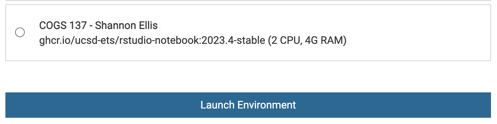
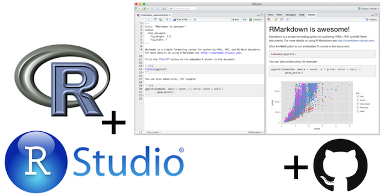
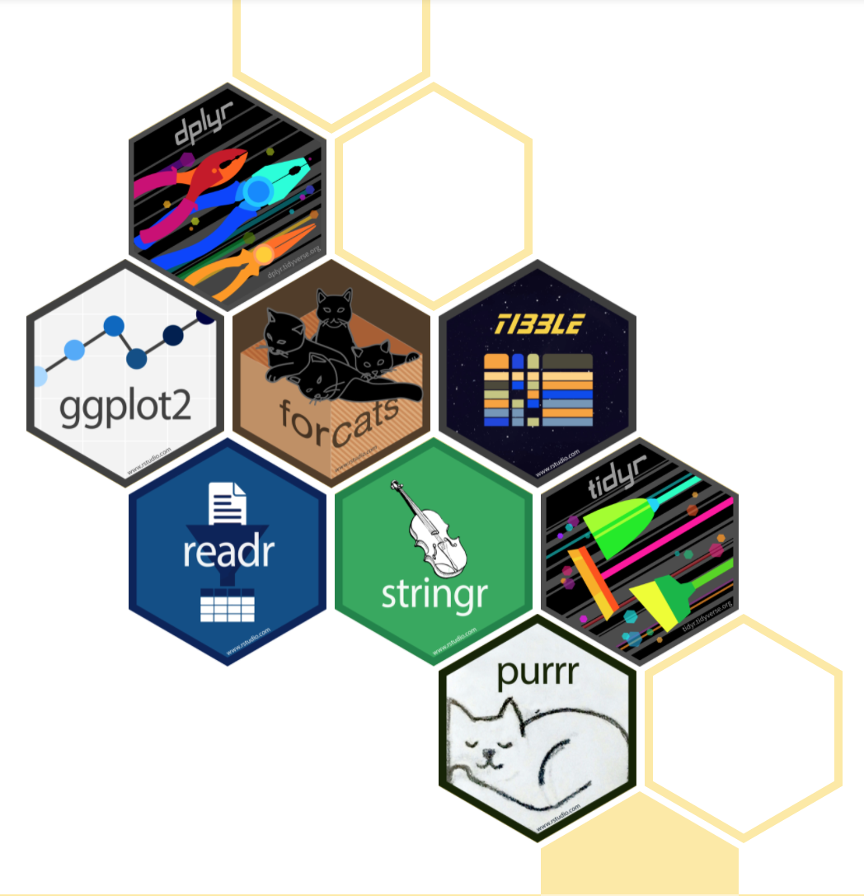
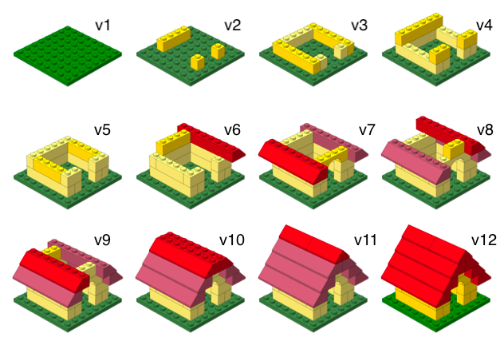
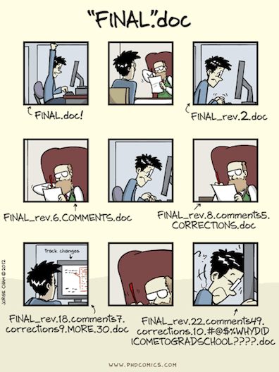

```{r echo=FALSE, message=FALSE, warning=FALSE}
library(tidyverse)
library(emo)

knitr::opts_chunk$set(fig.height = 2.65, dpi = 300, echo=TRUE) 
htmltools::tagList(rmarkdown::html_dependency_font_awesome())
```

# Tooling: Datahub, Quarto, Git/GitHub {background-color="#92A86A"}

## Q&A {.scrollable .smaller}

::: {.callout-note collapse="true" title="Q: Nothing so far, maybe how the assignments will look but I will figure that out when I see one!"}
The labs will guide you through the content we discuss in class, so you'll get to practice on your own. The homeworks will extend beyond that, giving you less on *exactly* what to do so that you can really master the concept, after having seen it in lecture and practiced on the labs.
:::

::: {.callout-note collapse="true" title="Q: Im curious exactly why r program is preferred for stats if you can do the same with python."}
This is a great question and the answer isn't super straightforward. It's somewhat historical. This is my *personal* retelling. Some may disagree with parts of it. Data science grew as a field out of both statistics and computer science (and other fields!). Those who came from CS tended to prefer "general" programming languages, like Python. Those who came from stats, preferred statistical programming languages, like R. *Now* I would argue that Python would *not* have become the *lingua franca* of data science (from the CS side) if Wes McKinney had not developed the pandas package (take COGS 108 if you want pandas experience!). Similarly, if Hadley Wickham hadn't developed the tidyverse in R, it would not be the second most popular language. Now, there are two different places where you can do all the data science things, and often it comes down to who you're working with, what their background is, and what your preference is. However, with GenAI (and its ability to "translate" between programming languages, we'll see what the future holds!
:::

::: {.callout-note collapse="true" title="Q: I am curious what a case study looks like for data science! I have done many design case studies but how does that differ from this class?"}
The term in a general sense is the same - a project deliverable that demonstrates your knowledge. But the core difference is that in design you're often asking (and answering) whether the thing built is right for its users and questioning/designing around these choices. Data science case studies, however, typically ask a question (on any topic!) and then use data to answer that question and quantify uncertainty in that answer.
:::

::: {.callout-note collapse="true" title="Q: When citing outside resources we used to complete something for this class, is that a separate form or will we just cite on the bottom of the datahub worksheet like COGS 108?"}
It will be the last section in the same document (same as in COGS 108) so you won't forget/have to submit a separate thing.
:::

## Course Announcements

**Due Dates**:

- 🔘 **Student survey** (#finaid) due Fri 10/2 (11:59 PM)

- ⌨️ **Lab01** due Friday 10/2 (11:59 PM)

::: small
  - repos will be created in coming days for you to complete, but I need your GH usernames first
:::

- 🔘 **Lecture Participation survey** "due" after class

- 📝 First round of **COGS 137 Org Invites** went out - accept these. If you didn't receive:

::: small
    -   complete the pre-course survey OR
    -   Respond to the email for your GitHub username today (subject: "COGS 137 GH username? (please reply asap, ideally by EOD Monday)"), so your repos can be created OR
    -   email me your GitHub username from your UCSD email
:::

Please take one [green]{.sticky-green} sticky and one [pink]{.sticky-pink} sticky as they come around. If you're able, try and save these. We'll use them most classes. (But, I'll always have extra!)

## Agenda

1.  Datahub, R & RStudio
2.  Quarto
3.  Git & GitHub (and how you'll get your assignments)
4.  Getting help

## Datahub

Datahub is a platform hosted by UCSD that gives students access to computational resources.

This means that while you'll be typing on your keyboard, you'll be *using* UCSD's computers in this class.

Website: <https://datahub.ucsd.edu/>

. . .

**Launch Environment**

When working on "stuff" for this course, select the COGS 137 environment (if you see two, pick either one...just make sure it says COGS 137).



## Datahub Usage

Q: Do I *have* to use datahub?

A: Nope. You could download and install all the packages we use and complete the course locally! However, many packages have already been installed for you on datahub, so it will be a tiny bit more work up front...but you won't be dependent on the internet/datahub!

## Toolkit



-   Scriptability $\rightarrow$ R

-   Literate programming (code, narrative, output in one place) $\rightarrow$ Quarto

-   Version control $\rightarrow$ Git / GitHub

-   The Internet (Google/ChatGPT/etc.)

## R and RStudio {.scrollable}

::: panel-tabset
### R/RStudio

**R & RStudio**

-   R is a statistical programming language
-   RStudio is a convenient interface for R (an integreated development environment, IDE)

### Tour

::: {.hand-green style="text-align: center;"}
<center>\[DEMO\]</center>
:::

Concepts introduced:

-   Console
-   Using R as a calculator
-   Environment
-   Loading and viewing a data frame
-   Accessing a variable in a data frame
-   R functions

### Try

**Your Turn**

::: task
1.  Login to datahub
2.  Carry out a mathematical operation in the console
3.  View the `airquality` dataframe
4.  Access a column from the `airquality` dataframe
5.  Calculate the median for one of the numeric columns
:::

Put a [green]{.sticky-green} sticky on the front of your computer when you're done. Put a [pink]{.sticky-pink} if you want help/have a question.

### R packages

-   **Packages** are the fundamental units of reproducible R code. They include reusable R functions, the documentation that describes how to use them, and sample data [^1]
-   As of Sept 2026, there are \~25,000 R packages available on **CRAN** (the Comprehensive R Archive Network)[^2]
-   We're going to work with a small (but important) subset of these!
:::

[^1]: Wickham and Bryan, [R Packages](https://r-pkgs.org/)

[^2]: [CRAN contributed packages](https://cran.r-project.org/web/packages/)

## What is the Tidyverse?

::: columns
::: {.column width="40%"}

:::

::: {.column width="60%"}
<center><a href="https://www.tidyverse.org/">tidyverse.org</a></center>

-   The tidyverse is an opinionated collection of R packages designed for data science.
-   All packages share an underlying philosophy and a common syntax.
:::
:::

## RStudio Projects[^3]

[^3]: [RStudio Projects Documentation](https://support.rstudio.com/hc/en-us/articles/200526207-Using-Projects)

-   Built-in functionality to keep all files for a single project organized

## Quarto

-   Fully reproducible reports -- each time you render, the document is executed from top to bottom
-   Simple markdown syntax for text
-   Code goes in chunks, defined by three backticks, narrative goes outside of chunks

## Quarto tips

-   Keep the [Quarto cheat sheet](https://rstudio.github.io/cheatsheets/quarto.pdf) and Markdown Quick Reference (Help -\> Markdown Quick Reference) handy, we'll refer to it often as the course progresses

-   The workspace of your Quarto document is separate from the Console

<br><br>

::: {.hand-green style="text-align: center;"}
<center>\[DEMO\]</center>
:::

## How will we use Quarto?

-   Every lab / case study / project / homework / notes / etc. is a Quarto (.qmd) document
-   You'll always have a template Quarto document to start with
-   The amount of scaffolding in the template will decrease over the quarter

. . .

::: {.hand-green style="text-align: center;"}
<center>\[DEMO\]</center>
:::

<br><br>

Concepts introduced:

-   Rendering documents
-   Quarto and (some) R syntax

## Collaboration: Git & GitHub

-   The statistical programming language we'll use is R
-   The software we use to interface with R is RStudio
-   But how do I get you the course materials that you can build on for your assignments?
    -   I'm not going to email you documents, that would be a mess!

## Version control

-   We introduced GitHub as a platform for collaboration
-   But it's much more than that...
-   It's actually designed for version control

## Versioning



## Versioning

with human readable messages


## Why do we need version control?



## Git and GitHub tips {.scrollable}

-   Git is a **version control** system -- like "Track Changes" feature Google Docs...but optimized for code. GitHub is the home for your Git-based projects on the internet -- like Drive with additional features for code.

. . .

-   There are millions of git commands -- ok, that's an exaggeration, but there are a lot of them -- and very few people know them all. **99% of the time you will use git to add, commit, push, and pull**.

. . .

-   We will be doing Git things and interfacing with GitHub through RStudio, but if you google for help you might come across methods for doing these things in the command line -- skip that and move on to the next resource unless you feel comfortable trying it out.

::: aside
Resource: [happygitwithr.com](http://happygitwithr.com/): book for working with git in R; Some content is beyond the scope of this course, but it's a good resource
:::

## Let's take a tour -- Git / GitHub

**You'll set this up yourself in Lab 01 on Thursday**

Concepts introduced:

-   Connect an R project to Github repository
-   Working with a local and remote repository
-   Committing, Pushing and Pulling

There is a bit more of GitHub that we'll use in this class, but for today this is enough.

## GitHub in COGS 137

Your repos will be created *for* you: no assignment links to click.

::: incremental
1.  Create a GitHub account (if you don't have one)
2.  Submit your GitHub username (pre-course survey) \<- **do this today**
3.  Accept the one-time invite to the `COGS137-FA26` organization (email, or [github.com/orgs/COGS137-FA26/invitation](https://github.com/orgs/COGS137-FA26/invitation))
4.  Find your repos at [github.com/COGS137-FA26](https://github.com/COGS137-FA26): `labXX-<username>`, `hwXX-<username>`, `csXX-<team>`, `final-<team>`
:::

::: aside
Full details on the [Computing Access](../../computing/computing-access.qmd#github) page. SSH setup happens in Lab 01 (Thursday).
:::

## Demo-ing the process

::: aside
You cannot yet do this. I want you to see it before you can try to follow along and do it. It will be re-demoed in lab *and* it will be on the podcast for future reference. 
:::

1.  Go to the [course GitHub organization](https://github.com/COGS137-FA26) and find your `lab01-<your GitHub username>` repo
2.  Copy the repo's SSH URL
3.  Clone the repo
4.  Edit the document
5.  **Render the document**
6.  Push your changes

# Getting Help

-   Trying things out
-   Understanding Documentation
-   Using ChatGPT/LLMs

## Documentation

Consider `ggplot2` (a package we'll learn a lot)

::: incremental
-   Official documentation (CRAN): https://cran.r-project.org/web/packages/ggplot2/index.html
-   Code (Github): https://github.com/tidyverse/ggplot2
-   Documentation: https://ggplot2.tidyverse.org/reference/index.html
-   Specific Function: https://ggplot2.tidyverse.org/reference/geom_point.html
:::

## GenAI: What it could look like

Imagine: You've been asked to carry out a number of wrangling operations on a dataset and make a plot...

::: {.hand-green style="text-align: center;"}
<center>\[DEMO\]</center>
:::

## Additional help

-   classmates
-   course staff (OH, Q&A, class, lab)

## Recap

Can you answer these questions?

-   What is R vs RStudio?
-   What are RStudio Projects?
-   What is version control, and why do we care?
-   What is git vs GitHub (and do I need to care)?
-   What are the components of a Quarto (.qmd) file?
-   Where will I find my repos for this course?

## Additional `git` Resources {.scrollable}

#### Version Control (git and GitHub):

-   [Getting Started with git](https://docs.github.com/en/free-pro-team@latest/github/getting-started-with-github)
-   [GitHub Guide](https://guides.github.com/activities/hello-world/)
-   [GitHub Desktop App Tutorial](https://github.com/jlord/git-it-electron)
-   [Git Command Line Resource](https://rogerdudler.github.io/git-guide/)
-   Using `git` from the command line
    -   [Installing and using `git` (Part 1)](https://www.youtube.com/watch?v=ng4X6qF8XVY), by COGS 108 TA Ganesh (youtube, 22min tutorial)
    -   [merge conflicts and branching (Part 2)](https://youtu.be/Nk1gtrbTZ2Y), by IA Shubham Kulkarni (youtube, 8min tutorial)
-   [Using `git` with GitHub Desktop](https://youtu.be/zQc5vQEBips), by COGS 108 TA Sidharth Suresh (youtube, 13min tutorial)
-   [GIT & GITHUB TUTORIAL](https://www.youtube.com/watch?v=xuB1Id2Wxak), from edureka!
    -   with [notes](https://docs.google.com/document/d/1GAdkvn7lWzeLekvC343WNZC2rZGhQOfPOU2dMha9aws/edit) from COGS 18/108 TA Holly(Yueying) Dong
