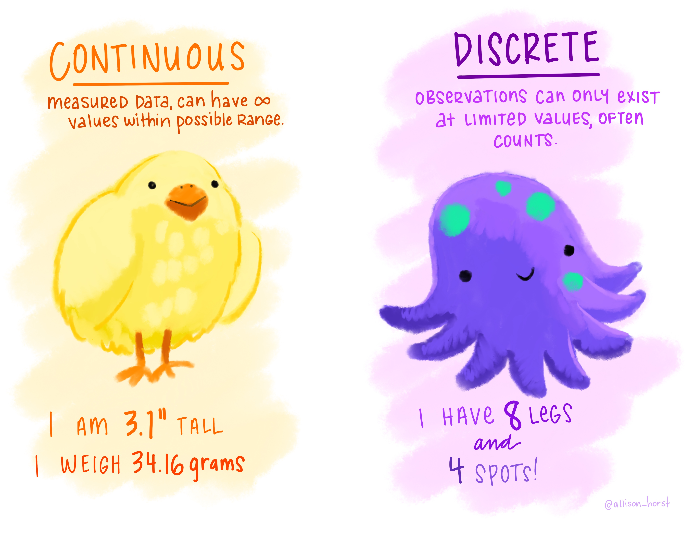
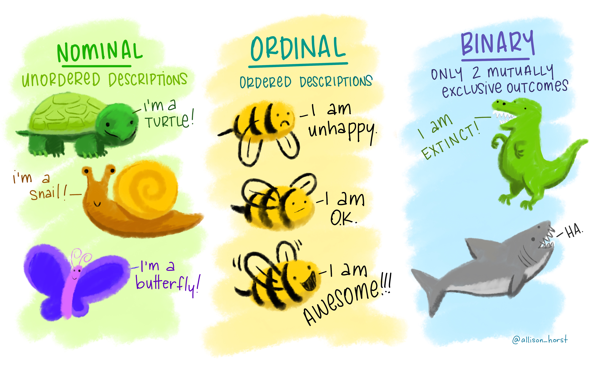

# Introduction to R {background-color="#92A86A"}

```{r echo=FALSE, message=FALSE, warning=FALSE}
library(tidyverse)
library(DT)

# Set dpi and height for images
knitr::opts_chunk$set(fig.height = 2.65, dpi = 300, echo=TRUE) 
```

## Q&A {.scrollable .smaller}

::: {.callout-note collapse="true" title="Q: What are some other important functions in R that we should keep in mind?"}
We'll get to these today and Monday! The most important will be the verbs in the tidyverse - on Monday!
:::

::: {.callout-note collapse="true" title="Q: Does Quarto take in / print code? Or is it primarily used just for text-based content?"}
It will display code as well as execute it on render. It's for text and code.
:::

::: {.callout-note collapse="true" title="Q: I'm curious about how we'll be able to manipulate datasets using R, or if this is something we will end up doing. I wonder how using R will compare to using excel."}
In lots of ways, Excel can do many of the things you can do with data in R; however, R has the advantage of being reproducible. This means you write the code once, but can execute it as many times as you want. This is unlike Excel, where each time you want to do something, you have to point/click to make it happen. And, there's not a record of what's been done, so being able to reproduce what someone else has done is nontrivial.
:::

::: {.callout-note collapse="true" title="Q: I think I was confused as to the use of Quarto when we were running code on the console of Rstudio but I understood how Quarto is used as a source to save code, but im curious as to why the console was not made to save it."}
Technically you can save your console, but for our purposes we're not going to because it's not particularly readable. Think of the console as a place to try things out, but anything you really want to save/keep/organize should go in a (quarto) document
:::

## Course Announcements

**Due Dates**:

-   🔘 **Student survey** (#finaid) due Fri 10/2 (11:59 PM)
-   ⌨**Lab 01** is due Friday - repos are available for those whose GitHub names I have
    - if no lab01 available on GH, please either complete pre-course survey or email me (sellis\@ucsd.edu) your GitHub username
    - first lab is tomorrow (Th 5P)!
-   🔘 Lecture Participation survey "due" after class

## Agenda

1.  Variables
2.  Operators
3.  Data in R

# Variables & Assignment {background-color="#92A86A"}

## Variables & Assignment

Variables are how we store information so that we can access it later.

. . .

Variables are created and stored using the assignment operator `<-`

```{r}
first_variable <- 3
```

The above stores the value 3 in the variable `first_variable`

. . .

Note: Other programming languages use `=` for assignment. R *also* uses that for assignment, but it is more typical to see `<-` in R code, so we'll stick with that.

. . .

This means that if we ever want to reference the information stored in that variable later, we can "call" (mean, type in our code) the variable's name:

```{r}
first_variable
```

## Variable Type

-   Every variable you create in R will be of a specific type.

. . .

-   R is **dynamically typed**: you don't declare a type ahead of time. R sets the type when you assign a value (and the type can change if you reassign the variable).

. . .

-   Determining the type of a variable with `class()`:

```{r}
class(first_variable)
```

## Basic Variable Types

| Variable Type | Explanation                       | Example                                     |
|----------------|------------------------|--------------------------------|
| character     | stores a string                   | `"cogs137"`, `"hi!"`                        |
| numeric       | stores whole numbers and decimals | `9`, `9.29`                                 |
| integer       | specifies integer                 | `9L` (the `L` specifies this is an integer) |
| logical       | Booleans                          | `TRUE`, `FALSE`                             |
| list          | store multiple elements           | `list(7, "a", TRUE)`                        |

Note: There are many more. We'll get to some but not all in this course.

## logical & character

**logical** - Boolean values `TRUE` and `FALSE`

```{r}
class(TRUE)
```

. . .

**character** - character strings

```{r}
class("hello")
class('students') # equivalent...but we'll use double quotes!
```

. . .

## numeric: double & integer

**double** - floating point numerical values (default numerical type)

```{r}
class(1.335)
class(7)
```

. . .

**integer** - integer numerical values (indicated with an `L`)

```{r}
class(7L)

```

. . .

## vectors

The most basic data structure in R is the **vector**: an ordered collection of values that are all the *same type*.

```{r}
c(1, 2, 3)                      # combine values with c()
1:5                             # shortcut for a sequence of integers
my_letters <- c("a", "b", "c")
length(my_letters)
class(my_letters)
```

. . .

A single value like `3` is just a vector of length 1.

## lists

So far, every variable has been an **atomic vector**: it can hold many values, but they must all be the *same type*.

. . .

**Lists** are 1d objects that can contain any combination of R objects -- including values of different types

::: columns
::: {.column width="50%"}
```{r}
mylist <- list("A", 7L, TRUE, 18.4)
mylist
```
:::

::: {.column width="50%"}
```{r}
str(mylist)
```
:::
:::

## Your Turn

Define variables of each of the following types: character, numeric, integer, logical, list

::: aside
Put a [green]{.sticky-green} sticky on the front of your computer when you're done. Put a [pink]{.sticky-pink} if you want help/have a question.
:::

## Functions

-   `class()` (and `View()` & `median()`) were our first functions...but we'll show a few more.

. . .

-   Functions are (most often) verbs, followed by what they will be applied to in parentheses.

. . .

Functions are:

-   available from base R
-   available from packages you import
-   defined by you

## Helpful Functions

::: columns
::: {.column width="50%"}
-   `class()` - determine high-level variable type

```{r}
class(mylist)
```

-   `length()`- determine how long an object is

```{r}
# contains 4 elements
length(mylist)
```
:::

::: {.column width="40%"}
-   `str()` - display the structure of an R object

```{r}
str(mylist)
```
:::
:::

## Coercion

A vector can only hold one type. If you combine different types, R **coerces** (converts) them to a common type -- without any warning.

(This is separate from dynamic typing, which is about how a *variable* gets its type.)

. . .

🤔 **Predict:** What will each of these return?

```{r}
#| eval: false
c(1, "Hello")
c(FALSE, 3L)
c(1.2, 3L)
```

::: aside
Put a [green]{.sticky-green} sticky on the front of your computer when you have your predictions.
:::

## Coercion: Answers

```{r}
c(1, "Hello")
c(FALSE, 3L)
c(1.2, 3L)
```

. . .

R converts to the most flexible type needed:

**logical** → **integer** → **double** → **character**

## Missing Values {.smaller}

R uses `NA` to represent missing values in its data structures.

```{r}
class(NA)
```

. . .

`NA` is "contagious": most calculations involving `NA` return `NA`...

```{r}
mean(c(1, 2, NA))
```

. . .

...unless you tell R to remove missing values first:

```{r}
mean(c(1, 2, NA), na.rm = TRUE)
```

## Other Special Values {.smaller}

`NaN` \| Not a number

```{r}
0 / 0
```

`Inf` \| Positive infinity

```{r}
1 / 0
```

`-Inf` \| Negative infinity

```{r}
-1 / 0
```

# Operators {background-color="#92A86A"}

## Operators

At its simplest, R is a calculator. To carry out mathematical operations, R uses **operators**.

## Arithmetic Operators

| Operator    | Description                   |
|-------------|-------------------------------|
| `+`         | addition                      |
| `-`         | subtraction                   |
| `*`         | multiplication                |
| `/`         | division                      |
| `^` or `**` | exponentiation                |
| `x %% y`    | modulus (x mod y) `9%%2` is 1 |
| `x %/% y`   | integer division `9%/%2` is 4 |

## Arithmetic Operators: Examples

```{r}
7 + 6  
2 - 3
4 * 2
9 / 2
```

## Reminder

Output can be stored to a variable

```{r}
my_addition <- 7 + 6
```

. . .

```{r}
my_addition
```

## Comparison Operators

These operators return a Boolean.

| Operator | Description              |
|----------|--------------------------|
| `<`      | less than                |
| `<=`     | less than or equal to    |
| `>`      | greater than             |
| `>=`     | greater than or equal to |
| `==`     | exactly equal to         |
| `!=`     | not equal to             |

## Comparison Operators: Examples

```{r}
4 < 12
4 >= 3
6 == 6
7 != 6
```

## Logical Operators

Combine (or negate) `TRUE`/`FALSE` values. You'll use these constantly to filter data.

-   `&` **and**: `TRUE` only if *both* sides are `TRUE`
-   `|` **or**: `TRUE` if *either* side is `TRUE`
-   `!` **not**: flips `TRUE` ↔ `FALSE`

```{r}
(4 < 12) & (6 == 6)
(4 > 12) | (6 == 6)
!(6 == 6)
```

## Your Turn

1.  Store your age (in years) in the variable `my_age`.
2.  Use arithmetic to calculate (roughly) how many days old you are. Store it in `days_old`.
3.  Use comparison and logical operators to check whether `days_old` is between 7,000 and 10,000.

::: aside
Put a [green]{.sticky-green} sticky on the front of your computer when you're done. Put a [pink]{.sticky-pink} if you want help/have a question.
:::

# R Packages {background-color="#92A86A"}

## Packages {.smaller}

-   **Install** a package *once per computer* with `install.packages()`
-   **Load** it *in every session* (and at the top of every Quarto document that uses it) with `library()`

```{r eval=FALSE}
install.packages("package_name")   # once
library(package_name)              # every time
```

. . .

Think of it like an app: you install it once, but you open it every time you want to use it.

. . .

In this course, *most* packages we'll use have been installed for you already on datahub, so you will only have to load the package in (using `library`).

. . .

::: {.callout-tip title="Question"}
Should `install.packages()` go in your **Quarto document** or in the **console**? Why?

*Hint:* Think back to our discussion on the first day about what the console is for vs. what a Quarto document is for...and what happens every time you render.
:::

# Data "sets" {background-color="#92A86A"}

## Data "sets" in R {.scrollable .smaller}

-   "set" is in quotation marks because it is not a formal data class

-   A tidy data "set" can be one of the following types:

    -   `tibble`
    -   `data.frame`

-   We'll often work with `tibble`s:

    -   `readr` package (e.g. `read_csv` function) loads data as a `tibble` by default
    -   `tibble`s are part of the tidyverse, so they work well with other packages we are using
    -   they make minimal assumptions about your data, so are less likely to cause hard to track bugs in your code

## Data frames

:::smaller
-   A data frame is the most commonly used data structure in R, they are list of equal length vectors (usually atomic, but can be generic). Each vector is treated as a column and elements of the vectors as rows.

-   A tibble is a type of data frame that ... makes your life (i.e. data analysis) easier.

-   Most often a data frame will be constructed by reading in from a file, but we can create them from scratch.
:::
```{r}
df <- tibble(x = 1:3, y = c("a", "b", "c"))
class(df)
glimpse(df)
```

## Data frames (cont.)

Columns (variables) in data frames are accessed with `$`:

```{r eval=FALSE}
dataframe$var_name
```

. . .

```{r}
class(df$x)  # access variable type for column
class(df$y)  
```

## Variable Types

Data stored in columns can include different *kinds* of information...which would require a different *type* (`class`) of variable to be used in R.

::: columns
::: {.column width="50%"}

:::

::: {.column width="50%"}
R Data Types:

-   **Continuous**: numeric
-   **Discrete**: integer or numeric (e.g., counts like number of cats)

Categorical data (next slide) are often stored as **factors** -- we'll cover these in a coming lecture.
:::
:::

::: aside
Artwork by [\@allison_horst](https://github.com/allisonhorst/stats-illustrations/)
:::

## Variable Types (cont.)

Sometimes data are non-numeric and store words. Even when that is the case, the data can be conveying different information.

::: columns
::: {.column width="50%"}

:::

::: {.column width="50%"}
R Data Types:

-   **Nominal**: character
-   **Ordinal**: factors
-   **Binary**: logical OR numeric OR factors
:::
:::

::: aside
Artwork by [\@allison_horst](https://github.com/allisonhorst/stats-illustrations/)
:::

## Example: Cat lovers

A survey asked respondents their name and number of cats. The instructions said to enter the number of cats as a numerical value.

. . .

[🚨 There is code ahead that we're not going to discuss in detail today, *but* we will in coming lectures.]{style="background-color: #e94f58"}

```{r load-data-real,include=FALSE}
cat_lovers <- read_csv("data/cat-lovers.csv")
```

```{r load-data-fake, eval=FALSE}
cat_lovers <- read_csv("https://raw.githubusercontent.com/COGS137/datasets/main/cat-lovers.csv")
```

## The Data

```{r message=FALSE}
cat_lovers |>
  datatable()
```

## The Question

[How many respondents have a below average number of cats?]{style="background-color: #ADD8E6"}

. . .

**Giving it a first shot...**

```{r}
cat_lovers |>
  summarise(mean = mean(number_of_cats))
```

. . .

[💡 maybe there is missing data in the `number_of_cats` column!]{style="background-color: #ADD8E6"}

**Oh why will you *still* not work??!!**

```{r}
cat_lovers |>
  summarise(mean_cats = mean(number_of_cats, na.rm = TRUE))
```

. . .

[💡 What is the **type** of the `number_of_cats` variable?]{style="background-color: #ADD8E6"}

## Take a breath and look at your data

. . .

```{r}
glimpse(cat_lovers)
```

## Let's take another look

```{r echo=FALSE}
cat_lovers |>
  datatable()
```

## Sometimes you need to babysit your respondents {.smaller}

```{r}
cat_lovers |>
  mutate(number_of_cats = case_when(name == "Ginger Clark" ~ 2,
                                    name == "Doug Bass" ~ 3,
                                    .default = as.numeric(number_of_cats)))
```

. . .

⚠️ Notice the warning: `as.numeric()` couldn't convert some values (the text answers) to numbers, so it made them `NA`. That's R telling you your data had text in it! Here, `case_when()` replaces those rows, so it's safe.

## Always respect (& check!) data types

```{r}
#| warning: false
cat_lovers |>
  mutate(number_of_cats = case_when(name == "Ginger Clark" ~ 2,
                                    name == "Doug Bass" ~ 3,
                                    .default = as.numeric(number_of_cats))) |>
  summarise(mean_cats = mean(number_of_cats))
```

## Now that we know what we're doing...

```{r}
#| warning: false
cat_lovers <- cat_lovers |>
  mutate(number_of_cats = case_when(name == "Ginger Clark" ~ 2,
                                    name == "Doug Bass" ~ 3,
                                    .default = as.numeric(number_of_cats)))
```

... store your data in a variable (here we're overwriting the old `cat_lovers` tibble).

## Answering the question

[How many respondents have a below average number of cats?]{style="background-color: #ADD8E6"}

```{r}
cat_lovers |>
  filter(number_of_cats < mean(number_of_cats)) |>
  nrow()
```

. . .

`filter()` keeps only the rows that meet a condition (here, a comparison operator!). More on this in a coming lecture.

## Moral of the story

-   If your data does not behave how you expect it to, type coercion upon reading in the data might be the reason.

-   Go in and investigate your data, apply the fix, *save your data*, live happily ever after.

## Recap {.smaller .scrollable background-color="#92A86A"}

-   Always best to think of data as part of a tibble
    -   This plays nicely with the `tidyverse` as well
    -   Rows are observations, columns are variables
-   What are the common variable types in R
    -   How do I create a variable of each type?
    -   When would I use each one?
-   What is a vector, and why must its values all be the same type?
-   Do I know how to determine the class/type of a variable?
-   Can I explain dynamic typing? How is it different from coercion?
-   Can I operate on variables and values using...
    -   arithmetic operators?
    -   comparison operators?
    -   logical operators?
-   What does `NA` do in a calculation, and how do I handle it?
-   What are dataframes/tibbles? and why are they useful?
-   What is the difference between installing and loading a package?
