```{r packages, echo = FALSE, message=FALSE, warning=FALSE}
library(tidyverse)
library(emo)

knitr::opts_chunk$set(dpi = 300, echo=TRUE, warning=FALSE, message=FALSE) 
```

# CS01: Biomarkers of Recent Use {background-color="#92A86A"}

## Q&A (10/2) {.scrollable .smaller}

<!-- Copy this box once per question. Put the question after "Q:" in the title and your answer in the body. -->

::: {.callout-note collapse="true" title="Q: I'm a little curious how often we'll be using integer variable types, and what we'll be using them for. At the moment I don't see a clear benefit."}
A: For our purposes, we won't. Numerics will work for our needs. The only times one would really want to ensure an integer are: 1) if a function input/code requires an integer or 2) when you want to be *very* explicit about counts or indices, which will always be integers.  
:::

::: {.callout-note collapse="true" title="Q: curious how loops would work but i presume it will be largely irrelevant"}
A: Ah, loops! They have a *unique* syntax in R. I'll include one here for reference, but you're right that we won't be looping often.

```r
for (i in 1:5) {
  print(i)
}
```
:::

## Q&A (10/5) {.scrollable .smaller}


::: {.callout-note collapse="true" title="Q: I am curious about what would happen with a vector that uses a boolean with a character string."}
A:  It would coerce to a string! `c(FALSE, "shan")`
:::

::: {.callout-note collapse="true" title="Q: It seems like you can't get any errors in R, is there a way to get an error."}
A:   Yes! Lots of errors - we'll see some in class. But, one note is that they are red....but so are warnings and other output....so just b/c you see red doesn't mean that there is an error. But, if you're thinking about dividing by zero giving Inf, you're right that that would produce an error in other programming languages. (`(FALSE, "shan")` would return an error...b/c it's missing the `c` before the open parentheses if you want ot see one)
:::


## Course Announcements

**Due Dates**:

-   🔘 Lecture Participation survey "due" after class
-  **Lab01** due Friday (we'll cover material on Wed, so I wouldn't start this yet)
-  **HW01** due Sunday (can get started; we'll finish content in next set of lecture notes)


## Agenda

-   Background
-   Data Intro
-   Paper Results
-   Wrangle

# Background {background-color="#92A86A"}

## Case Studies in COGS 137

-   Question + Data Provided
-   Wrangling + Analysis Discussed/Presented in Class
-   In groups:
    -   reproduce the analysis
    -   extend the analysis
    
. . .

Note: we're discussing this *before* you know who your CS01 group mates are. This is because everything here is what everyone will need to know. Also, everyone will individually be exploring the data in lab on Thursday...and I want *everyone* to have the background and work individually to understand the data.

## Deliverables

-   Full qmd report (explanations, text and story matter!)
-   General Audience communication

## CS01: Biomarkers of Recent Use

-   Focuses on Data Wrangling and EDA
-   Uses real research data from a collaboration w/ Rob Fitzgerald's group

## Motor Vehicle Accidents (MVAs)

-   2/3 of US trauma center admissions are due to MVAs
-   \~60% of such patients testing positive for drugs or alcohol
-   Alcohol and cannabis are most frequently detected

Source: [Hartman and Huestis, 2013](https://academic.oup.com/clinchem/article/59/3/478/5621997)

## Legalization of Marijuana

- Federally: recreational use still illegal (Schedule I); state-licensed medical marijuana moved to Schedule III in April 2026
- Medical use legal in ~40 states + DC
- Recreational use legal in 24 states + DC (including CA)

## Increased roadside surveys

::: incremental
-   25% increase in use nationwide from 2002 to 2015 ([survey](https://rosap.ntl.bts.gov/view/dot/1913))
-   THC detection in drivers increased by 48% from 2007 to 2014
-   Increased prevalence of consumption -\> possible intoxication -\> possible impaired driving -\> public health concern
:::

## DUI of Alcohol (DUIA)

::: incremental
-   The science is there. Don't do it.
-   DUIA has decreased since the 1970s
    -   \% of nighttime, weekend drivers testing over the legal limit (BAC \> 0.08 g/dL) decreased from 7.5% (1973) to 2.2% (2007) ([NHTSA roadside survey](https://rosap.ntl.bts.gov/view/dot/1913))
:::

## DUI of Cannabis

-   In a 2007 survey, 16.3% of nighttime drivers were drug-positive ([NHTSA roadside survey](https://rosap.ntl.bts.gov/view/dot/1913))
    -   8.6% of these tested positive for THC
-   Experimental and cognitive studies suggest cannabis-induced impairment increases risk of motor vehicle crashes:

. . .

> Evidence suggests recent smoking and/or blood THC concentrations 2–5 ng/mL are associated with substantial driving impairment, particularly in occasional smokers. ([Hartman & Huestis, *Clinical Chemistry*, 2013](https://academic.oup.com/clinchem/article/59/3/478/5621997))

## Roadside Detection

-   *per se* laws: "a driver is deemed to have committed an offense if THC is detected at or above a pre-determined cutoff" ([*Traffic Injury Prevention*, 2021](https://doi.org/10.1080/15389588.2020.1851685))

. . .

-   Defining cutoffs for safe driving is difficult
-   THC concentration differs by:
    -   "smoking topography" (time to smoke; number of puffs)
    -   frequency of use
    -   route of ingestion

. . .

## *Per se* laws today {.smaller}

As of October 2025 ([GHSA](https://www.ghsa.org/state-laws-issues/drug-impaired-driving)):

::: incremental
-   18 states have zero tolerance or *per se* cannabis laws
    -   **Zero tolerance** (any detectable amount): 10 states for THC *or its metabolites*; 4 states for THC only
    -   **Numeric *per se* limits**: 4 states, 2–5 ng/mL THC in blood (e.g., Ohio 2 ng/mL; Illinois, Montana, Washington 5 ng/mL)
-   Colorado: "permissible inference": ≥5 ng/mL THC in blood lets a court *infer* impairment (driver can rebut)
-   Most other states: the prosecution must show the driver was actually impaired
:::

. . .

-   Researchers continue to question whether any blood THC cutoff tracks impairment ([Bridging THC Knowledge Gaps, 2025](https://pmc.ncbi.nlm.nih.gov/articles/PMC12355012/))

[`r emo::ji("question")` Why might a zero tolerance law for THC *metabolites* be especially hard on frequent users?]{style="background-color: #ADD8E6"}

## Metabolism

::: incremental
-   peak blood concentrations occur during smoking, then drop rapidly ([Schwope et al., 2012](https://academic.oup.com/jat/article/36/6/405/791790))
-   subjective 'high' persists for several hours, varies greatly between individuals
-   THC concentrations remain detectable in frequent users longer than occasional users ([Bergamaschi et al., 2013](https://academic.oup.com/clinchem/article/59/3/519/5622035))
-   THC and certain metabolites can be detected in blood for weeks to months after use and do not necessarily indicate impairment
:::

## Detection

Various approaches:

1.  Detect impairment (officers detect DUIC)
2.  Detect recent use (test for compounds)
3.  Combine recent use + impairment

. . .

**Focus here**: Can we identify a biomarker of recent use?

-   recent use: defined here as within 3h
-   testing THC and metabolites in blood, oral fluid (OF), and breath

## Aside: Case Study Report

-   Your Case study will need a background section
-   It can use/summarize/paraphrase the information here (you should cite the source, not me)
-   But, you're *not* limited to this information
-   You are allowed/encouraged to dig deeper, include what's most important, add to, remove, etc.
-   There are a lot of citations in this section - go ahead and peruse them/others/use references in these papers

# Question {background-color="#92A86A"}

Which compound, in which matrix, and at what cutoff is the best biomarker of recent use?

# The Data {background-color="#92A86A"}

## Participants

-   placebo-controlled, double-blinded, randomized study

. . .

-   recruited:
    -   volunteers 21-55 y/o
    -   had a driver's license
    -   self-reported cannabis use \>= 4x in the past month

. . .

-   Participants were:
    -   compensated
    -   medically evaluated (for safety)
    -   asked to refrain from use for 2d prior to participation
    -   exclusion criteria: OF THC concentration ≥5 ng/mL on day of study (n=7)

. . .

-   Study included 191 participants

## Demographics

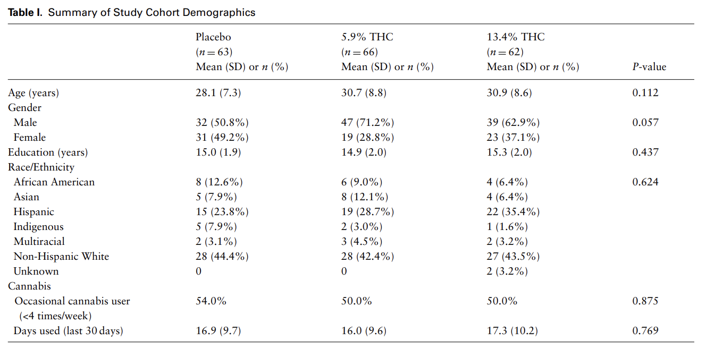

Source: [Hoffman et al.](https://academic.oup.com/jat/article/45/8/851/6309824?login=false)

## Experimental Design

Participants were:

::: incremental
-   randomly assigned to receive a cigarette containing placebo (0.02%), or 5.9% or 13.4% THC
-   Blood, OF and breath were collected prior to smoking
-   smoked a 700 mg cigarette *ad libitum* within 10 min, with a minimum of four puffs.
-   After smoking, 4 additional OF and breath and 8 blood collections were completed at time points up to ∼6h from the start of smoking.
-   Participants ate and drank water between collections, although not within 10 min of OF collection.
:::

## Timeline

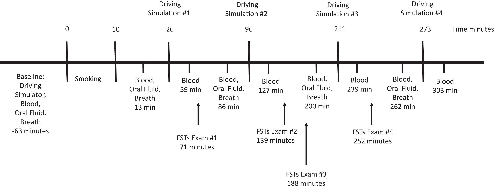

Source: [Fitzgerald et al.](https://academic.oup.com/clinchem/article/69/7/724/7179849?login=false)

## Consumption

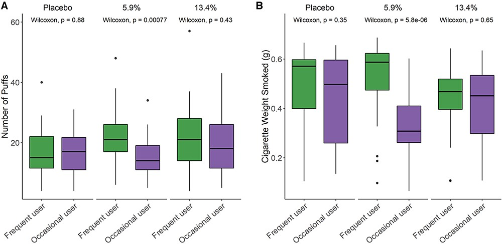 Source: [Hoffman et al.](https://academic.oup.com/jat/article/45/8/851/6309824?login=false)

## Topography

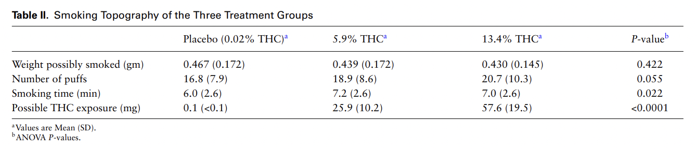 Source: [Hoffman et al.](https://academic.oup.com/jat/article/45/8/851/6309824?login=false)

## What do we recall?

-   Summarize what we know about Detection of Impairment for DUIC.
-   Summarize what experiment was carried out.
-   Summarize what we know about the data so far.

## Subjective Highness

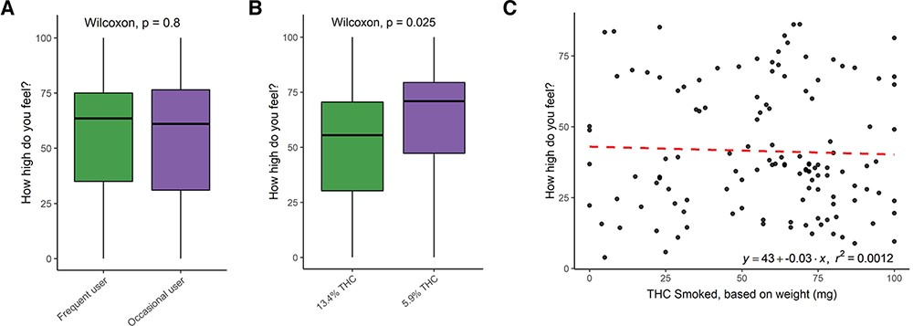

Source: [Hoffman et al.](https://academic.oup.com/jat/article/45/8/851/6309824?login=false)

## Our Datasets

Three matrices:

-   Blood (WB): 8 compounds; 190 participants; 9 collection timepoints (T1–T5B)
-   Oral Fluid (OF): 7 compounds; 192 participants; 5 timepoints (T1–T5A)
-   Breath (BR): 1 compound (THC); 191 participants; 5 timepoints (T1–T5A)

[`r emo::ji("question")` One study...so why 190, 192, and 191 participants?]{style="background-color: #ADD8E6"}

## Variables {.smaller}

-   `ID` \| participant identifier
-   `Treatment` \| Placebo, 5.90%, 13.40%
-   `Group` \| frequent vs. occasional user...but labeled differently across files:
    -   WB: "Frequent user" / "Occasional user"
    -   OF & BR: "Experienced user" / "Not experienced user"
-   `FLUID TYPE` (WB) / `Fluid` (OF, BR) \| which matrix the sample came from
-   `Timepoint` \| collection code (T1 = before smoking)
-   `time.from.start` \| minutes from the start of smoking (negative = before)
-   & measurements for individual compounds
    -   ng/mL in blood and oral fluid
    -   **pg/pad** in breath (`THC (pg/pad)`): not directly comparable to the others!

. . .

[`r emo::ji("question")` What will we need to fix before we can combine these three files?]{style="background-color: #ADD8E6"}

## The Data

You'll have access once your groups/repos are created...(today I want people to follow along; there will be time to try on your own soon!)

::: callout-important
These data are for our use only and not to be shared widely, so this case study cannot be put in your portfolio, but CS02 and your final project can!
:::

```{r, eval=TRUE}
WB <- read_csv("data/Blood.csv")
BR <- read_csv("data/Breath.csv")
OF <- read_csv("data/OF.csv")
```

## First Look at the data

```{r}
# column names, types, and missing values (no actual values, since these data are private)
data_overview <- function(df) {
  tibble(column    = names(df),
         type      = map_chr(df, \(x) class(x)[1]),
         n_missing = map_int(df, \(x) sum(is.na(x))))
}
```

In class (and in your own repo), `glimpse()` each data set to see example values too.

## First Look at the data (WB)

```{r, echo=FALSE}
data_overview(WB)
```

## First Look at the data (OF)

```{r, echo=FALSE}
data_overview(OF)
```

## First Look at the data (BR)

```{r, echo=FALSE}
data_overview(BR)
```

# Analysis

Where We're Headed...

Results from: Hubbard et al (2021) Biomarkers of Recent Cannabis Use in Blood, Oral Fluid and Breath ([*Journal of Analytical Toxicology*](https://academic.oup.com/jat/article/45/8/820/6311388))

## Fig 1: Pre-smoking

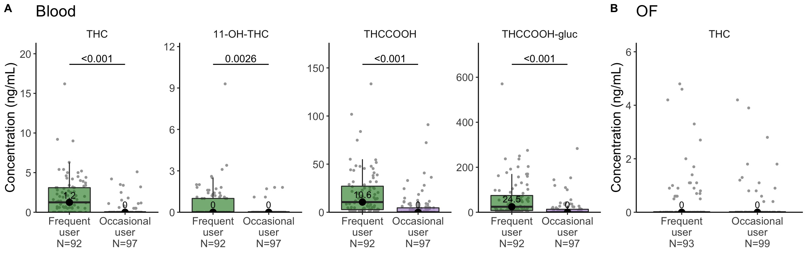

## Fig 2: Sensitivity and Specificity

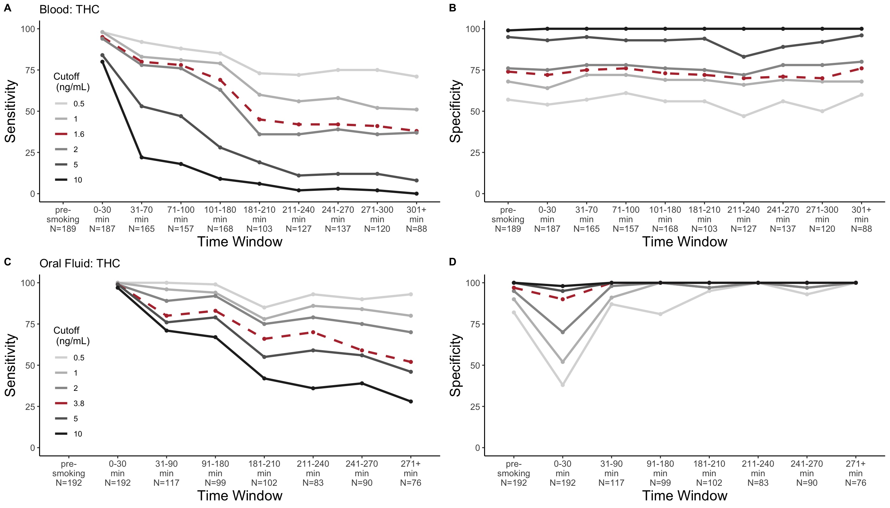

## Fig 3: Cross-compound relationship

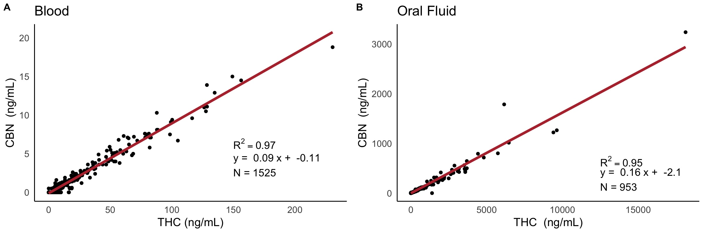

## Fig 4: Cutoffs

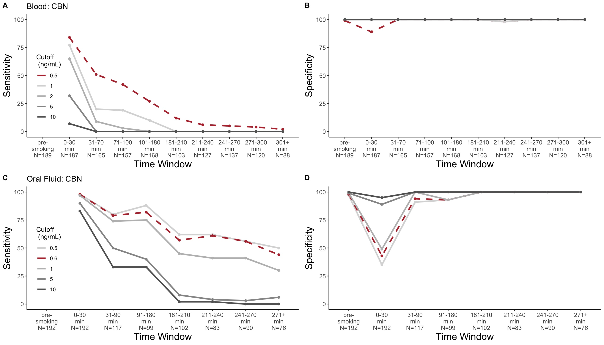

## Fig 5: Youden

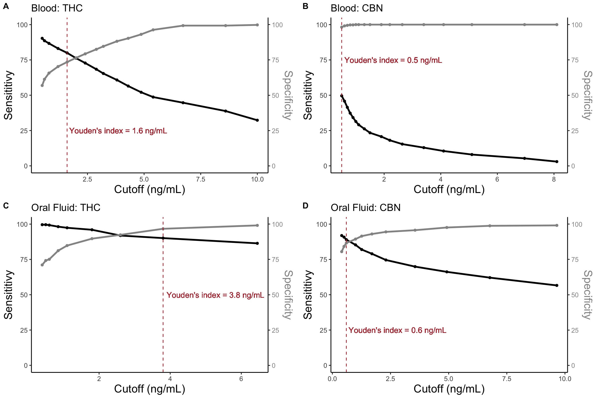

. . .

...and if there's time PPV and Accuracy post 3h

## What Came After

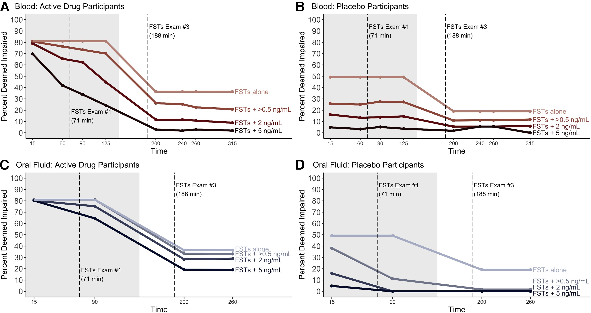 Source: [Fitzgerald et al.](https://academic.oup.com/clinchem/article/69/7/724/7179849?login=false)

## Recap {.smaller background-color="#92A86A"}

-   Could you summarize/explain background presented?
-   Could you summarize the experiment that was done?
-   Could you describe the datasets? (variables, observations, values, etc.)
