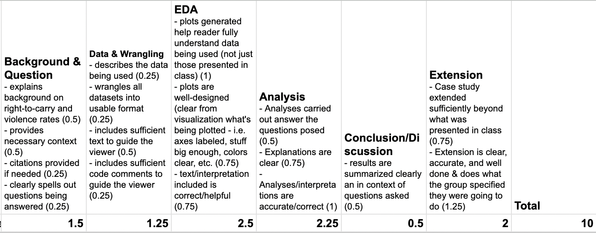
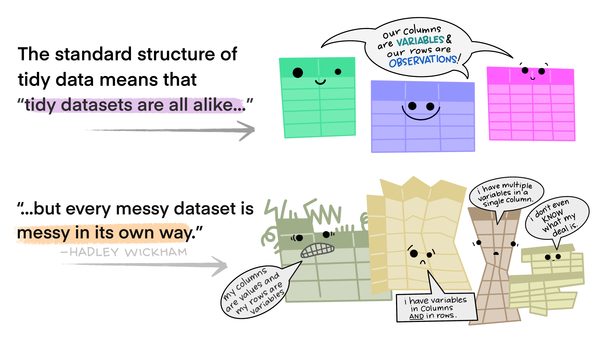
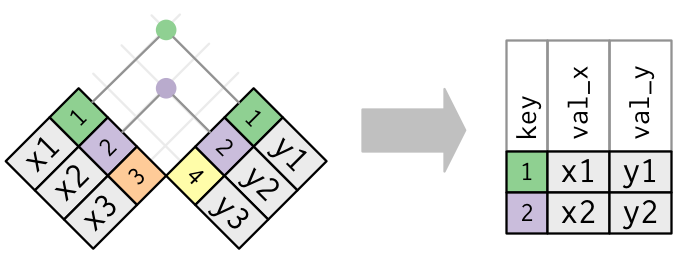

```{r packages, echo=FALSE, message=FALSE, warning=FALSE}
library(tidyverse)
library(patchwork)
library(emo)

# CS01 helper functions (displayed throughout these notes)
knitr::read_chunk("src/cs01_functions.R")

knitr::opts_chunk$set(dpi=300, echo=TRUE, warning=FALSE, message=FALSE) 
```

# CS01: Biomarkers of Recent Use (EDA) {background-color="#92A86A"}

## Q&A {.scrollable .smaller}

<!-- Copy this box once per question. Put the question after "Q:" in the title and your answer in the body. -->

::: {.callout-note collapse="true" title="Q: "}
A: 
:::

## Course Announcements

**Due Dates**:

-   ⌨️ **Lab 02** due Fri 10/16 (11:59 PM)
-   📚 **HW 02** due Sun 10/18 (11:59 PM)
-   ⌨️ **Lab 03** due Fri 10/23 (11:59 PM)
-   🔘 Lecture Participation survey "due" after class

::: callout-important
The CS01 data are data for you only. My collaborator is excited that y'all will be working on this...but these are still research data, so please do not share with others or post publicly.
:::

<!-- FA24 announcements, kept for reference:
**Due Dates**:

- `r emo::ji("science")` **Lab 03** due Thursday (10/24; 11:59 PM)
- `r emo::ji("computer")` **HW02** (Viz) due Mon (10/28; 11:59 PM)
- `r emo::ji('clipboard')` Lecture Participation survey "due" after class

**Notes**:

-   **hw01** and **lab02** scores posted; Scores on Canvas; feedback as "issue" on GH
-   **CS01 Groups** have been sent out
    -   email for contact 
    -   GitHub repo: `cs01-<team name>` in the [course GitHub organization](https://github.com/COGS137-FA26) \<- please open it and make sure you have access
    -   group mate feedback is required (on submission)
    
. . . 

::: callout-important
The CS01 data are data for you only. My collaborator is excited that y'all will be working on this...but these are still research data, so please do not share with others or post publicly.
:::
-->

## Suggested Reading

- 📕 R4DS Chapter 10: [EDA](https://r4ds.hadley.nz/eda)
- 📕 R4DS Chapter 25: [Functions](https://r4ds.hadley.nz/functions)

## Agenda
- CS01
  - Instructions 
  - Previous Projects
  - CS01 EDA
- `tidyr`
- Exploratory Data Analysis (EDA)

# CS01 {background-color="#92A86A"}


## CS01 Instructions 

Instructions are on [course website](https://cogs137-fa26.github.io/cogs137-fa26/content/cs/cs01.html).

Note: 

- Deliverables: Full report (.html) + general communication
- [Common Deductions](https://cogs137-fa26.github.io/cogs137-fa26/content/cs/cs01.html)

## Example Case Study

See & Discuss: [https://cogs137-fa26.github.io/cogs137-fa26/content/cs/cs01.html](https://cogs137-fa26.github.io/cogs137-fa26/content/cs/cs01.html)

## Feedback & Scores

Feedback to other students [here](https://docs.google.com/spreadsheets/d/1GZINOZImtmkRDLGrWrBYVFxPxpK2GewC40_XMelLh1E/edit?usp=sharing)

::: aside
You cannot see the projects, but can read all of the comments and see the associated score. Also, note that the same row is not the same group.
:::

. . . 

Common comments:

-   context/explanation/guidance/lacking
-   missing citations
-   failure to introduce/describe the data
-   making statements without evidence
-   need to edit for cohesiveness, story, clarity

## An (Example) Rubric

This is *NOT* the rubric for your case study, but it will be similar:




## Notes

::: incremental
-   Lots of code/plots will be provided here
-   You are free to include any of it in your own case study (no attribution needed)
-   You probably should NOT include all of them in your final report
-   For any of the "basic" plots you include in your report, you'll want to clean them up/improve their design.
-   Your final report should be polished from start to finish
:::

# Data Wrangling: `tidyr` {background-color="#92A86A"}

- pivots (`tidyr`)
- joins (`dplyr`)

## Reminder: Tidy Data


. . . 



. . . 


## Pivoting

Storing the same data in a different format

. . . 

### long vs. wide

-   **wide** data contains values that do not repeat in the first column. (analysis; storage)
-   **long** format contains values that do repeat in the first column. (plotting)


## pivots

- `pivot_longer` | take wide data and make it long
- `pivot_wider` | take long data and make it wide


## Joins

Combining data across different datasets, using common information (often: IDs)

. . . 

**Mutating Joins**

add new variables to a data frame from matching observations in another

. . . 

- **`left_join`**: keeps all rows in first df; adds all matching information from second df; adds NAs for any observations missing information
- **`right_join`**: keeps all observations in second df 
- **`full_join`**: keeps all observations in either df

. . . 


. . . 

**`inner_join`**: takes only rows in *both* dfs



## Binding dataframes

- `bind_rows()` - stack different dataframes on top of one another, combining information where column names are the same <- *what I used to combine the three datasets after wrangling*
- `bind_cols()` - stack dataframes next to one another; will assume rows match up <- use with caution


# Exploratory Data Analysis (EDA) {background-color="#92A86A"}

## EDA

The process of really getting to "know" your data: 

- calculating descriptive statistics (min, mean, median, max, etc.)
- univariate plots (histograms, densityplots, barplots) - distributions of single variables 
- bivariate plots (scatterplots, boxplots) - relationships between variables

. . . 

Notes: 

:::incremental
- Not every plot you generate in this process has to end up in your final report, but each plot should help you learn
- Every plot should NOT be *beautiful*. Save that time for the ones you ultimately use to communicate your findings
- There is NOT a formula for carrying out EDA. You stop once you understand your data fully.
- Lab03 is to get you started. Three plots is probably not enough for you to be fully comfortable with these data.
:::


# Data & Files {background-color="#92A86A"}

# Question {background-color="#92A86A"}

Which compound, in which matrix, and at what cutoff is the best biomarker of recent use?

## Our Datasets

Three matrices:

-   Blood (WB): 8 compounds; 190 participants
-   Oral Fluid (OF): 7 compounds; 192 participants
-   Breath (BR): 1 compound; 191 participants

. . . 

Variables:

-   `ID` \| participants identifier
-   `Treatment` \| placebo, 5.90%, 13.40%
-   `Group` \| Occasional user, Frequent user
-   `Timepoint` \| indicator of which point in the timeline participant's collection occurred
-   `time.from.start` \| number of minutes from consumption
-   & measurements for individual compounds

## The Data

Reading in the csv provided in lab03/cs01:

```{r}
cs01_data <- read_csv("data/cs01_combined.csv") |> 
  mutate(treatment = fct_relevel(treatment, "Placebo", "5.9% THC (low dose)"))
```


## Time windows & compounds {.scrollable}

Defined once in `src/cs01_functions.R` (and used by `clean_cs01()`, which made the time windows in this file):

```{r cs01_windows}
```

# CS01: EDA {background-color="#92A86A"}

## Single Variable (basic) plots


For a single compound...

```{r}
ggplot(cs01_data, aes(x=thc)) + 
  geom_histogram()
```
. . . 

But, we have three different matrices...

```{r}
ggplot(cs01_data, aes(x=thc)) + 
  geom_histogram() +
  facet_wrap(~fluid_type)
```

But what if we consider our experiment/the structure of our data? We have three different matrices...and a whole bunch of compounds. With wide data, it's not easy to plot these distributions, so you may want to pivot those data....

```{r cs01_to_long}
```

```{r}
cs01_long <- cs01_to_long(cs01_data)
```

::: aside
We select the compound columns *by name* (`cs01_compounds`), not by position (e.g. `7:15`), so this keeps working if the columns move.
:::

. . . 

Distributions across all compounds:

```{r}
ggplot(cs01_long, aes(x=value)) + 
  geom_histogram() +
  facet_wrap(~compound)
```

...but this still doesn't get at the differences between matrices *and* compound.

. . . 

Plotting some of these data...

```{r}
cs01_long |>
  mutate(group_compound=paste0(fluid_type, ": ", compound)) |>
ggplot(aes(x=value)) + 
  geom_histogram() + 
  facet_wrap(~group_compound, scales="free")
```

## THC & Frequency


```{r}
cs01_long |> 
  filter(compound == "thc") |>
  ggplot(aes(x=group, y=value)) + 
  geom_boxplot() +
  facet_wrap(~fluid_type, scales="free")
```

## THC & Treatment Group

```{r}
cs01_long |> 
  filter(compound == "thc") |>
  ggplot(aes(x=treatment, y=value)) + 
  geom_boxplot() +
  facet_wrap(~fluid_type, scales="free")
```

## Focus on a specific timepoint...

```{r}
cs01_long |> 
  filter(compound == "thc", timepoint %in% cs01_early_windows) |>
  ggplot(aes(x=treatment, y=value)) + 
  geom_boxplot() +
  facet_wrap(~fluid_type, scales="free")
```

## At this point...

We start to get a sense of the data with these quick and dirty plots, but we're really only scratching the surface of what's going on in these data.

. . .

These data require a lot of exploration due to the number of compounds, multiple matrices, and data over time aspects.


## Day 2 · Mon 10/19 {background-color="#92A86A"}

Functions & working across time windows.

## Brief Aside: User-Defined Functions

> You should consider writing a function whenever you’ve copied and pasted a block of code more than twice -Hadley

```{r, eval=FALSE}
function_name <- function(input){
  # operations using input
}
```

. . . 

For example...

```{r}
double_value <- function(val){
  val * 2
}
```

. . . 

To use/execute:

```{r}
double_value(3)
```


Additional resource: [https://r4ds.hadley.nz/functions](https://r4ds.hadley.nz/functions)

## Compounds across time

::: panel-tabset
### Function

Shared colors & theme (used by every CS01 plot):

```{r cs01_theme}
```

Our first user-defined function takes the data and the matrix as arguments:

```{r cs01_plot_time}
```


### Plots (WB)

```{r compounds-wb}
plot_scatter_time(cs01_long, "WB")
```

### OF

```{r compounds-of}
plot_scatter_time(cs01_long, "OF")
```

### BR

```{r compounds-br}
plot_scatter_time(cs01_long, "BR")
```

### Thoughts

:::incremental
- We do NOT have clear delineations in time
- This means there *could* be multiple measurements from a single individual within a specified timepoint (i.e. "0-30 min")
- We wouldn't want to include duplicate measures from the same individual within timepoint
- We wouldn't have known this without looking at our data...why EDA is necessary
:::

:::


## Dropping Duplicates (w/n time window)

```{r cs01_drop_dups}
```

```{r}
cs01_nodups <- drop_dups(cs01_data)
```

. . . 

Now to pivot_longer that...

```{r}
cs01_nodups_long <- cs01_to_long(cs01_nodups)
```

::: callout-note
While I drop duplicates *after* making the plots above, you and your group will want to think about when it should be done for telling the clearest story. The order we do things in EDA is not typically the order in which we communicate information.
:::


## Group Differences: Frequency of Use

::: panel-tabset
### Function

One function for both "frequency of use" and "treatment" comparisons: `x` says what to compare.

```{r cs01_plot_boxplots}
```

### WB

```{r, warning=FALSE}
plot_boxplots(cs01_nodups_long, "WB", x = group)
```

### OF

```{r, warning=FALSE}
plot_boxplots(cs01_nodups_long, "OF", x = group)
```

### BR

```{r, warning=FALSE}
plot_boxplots(cs01_nodups_long, "BR", x = group)
```

### Thoughts

::: incremental
- Certain compounds show different values between frequent and infrequent users. Worth considering what that means for our ultimate goal
- Breath at this first timepoint likely not very helpful...what about other timepoints?
:::

:::

## Group Differences: Treatment

::: panel-tabset
### Function

Same function as before...just a different `x`:

```{r, eval=FALSE}
plot_boxplots(cs01_nodups_long, "WB", x = treatment)
```

### WB

```{r all-the-plots-treatment, out.width='100%', fig.height=6}
plot_boxplots(cs01_nodups_long, "WB", x = treatment)
```

### OF

```{r, out.width='100%', fig.height=6}
plot_boxplots(cs01_nodups_long, "OF", x = treatment)
```

### BR

```{r}
plot_boxplots(cs01_nodups_long, "BR", x = treatment)
```

### Thoughts

::: incremental
- Argument for combining treatment groups? 
- Shared `ggplot2` settings live in `theme_cs01()` and `cs01_colors`, and one function makes both sets of boxplots. When you find yourself copy-pasting plot code, that's a function waiting to happen.
- These last two sets of plots have only focused on that first timepoint. You'll probably want to look beyond that. 
:::

:::

## Day 3 · Wed 10/21 {background-color="#92A86A"}

Sensitivity, specificity & choosing cutoffs: the core of the CS01 question.

# Some Metrics {background-color="#92A86A"}

## Sensitivity & Specificity

**Sensitivity** \| the ability of a test to correctly identify patients with a disease/trait/condition. $$TP/(TP + FN)$$

. . .

**Specificity** \| the ability of a test to correctly identify people without the disease/trait/condition. $$TN/(TN + FP)$$

. . .

[`r emo::ji("question")` For this analysis, do you care more about sensitivity? about specificity? equally about both?]{style="background-color: #ADD8E6"}

## What is a TP here? TN? FP? FN?

**Post-smoking** (cutoff \> 0)

::: incremental
-   TP = THC group, value \>= cutoff
-   FN = THC group, value \< cutoff
-   FP = Placebo group, value \>= cutoff
-   TN = Placebo group, value \< cutoff
:::

. . .

**Pre-smoking**

Cannot be a TP or FN before consuming...

-   TP = 0
-   FN = 0
-   FP = value \>= cutoff
-   TN = value \< cutoff

## The Code to come

::: callout-warning
This is beyond code I would expect you all to be able to write yourself. It's here so that 1) you can make these calculations and interpret the results,  2) because we have a wide range of background and experience. I want *everyone* to get as much as they can out of this course,  and 3) I do want you all to talk to one another. That's one reason you all are in groups for case studies.
:::


## Calculating Sensitivity and Specificity

::: panel-tabset
### The idea

For every matrix × compound × time window × cutoff, count TPs, FNs, FPs, and TNs.

::: incremental
1.  Start with the long, de-duplicated data (one row per person × window × compound)
2.  Copy each row once per cutoff (`cross_join()`)
3.  Label each row: *used* (THC group, after smoking)? *detected* (value ≥ cutoff)?
4.  `group_by()` + `summarize()` to count...exactly what you learned in the `dplyr` notes
:::

### Code

```{r cs01_sens_spec}
```

### Run

Reminder: Currently, states have laws on the books from zero tolerance (detection of any level) to 5ng/mL THC

```{r}
cs01_ss <- sens_spec(cs01_nodups_long, cutoffs = c(0.5, 1, 2, 5, 10))
cs01_ss
```

### THC @ 5 ng/mL

```{r}
cs01_ss |>
  filter(compound == "thc", cutoff == 5) |>
  select(fluid_type, timepoint, TP, FN, FP, TN, sensitivity, specificity)
```
:::

## Plot Results

::: panel-tabset
### Code

Note: requires `library(patchwork)`

```{r cs01_plot_cutoffs}
```

### WB

```{r}
plot_cutoffs(cs01_ss, "WB", "thc", title = "Blood")
```

### OF

```{r}
plot_cutoffs(cs01_ss, "OF", "thc", title = "Oral Fluid")
```

### BR

```{r}
plot_cutoffs(cs01_ss, "BR", "thc", title = "Breath")
```

### Thoughts

- This is only THC
- For five semi-random cutoffs
- There are other compounds and other cutoffs to consider
- Breath THC is measured in pg/pad (not ng/mL), so these cutoffs don't separate anything for breath (the lines overlap). What cutoffs would make sense there?
:::

## Possible Extensions

Our current question asks for a *single* compound...and you'll need to decide that.

. . .

...but you could imagine a world where more than one compound or more than one matrix could be measured at the roadside.

. . .

So:

::: incremental
-   combination of the oral fluid and blood that would better predict recent use? (For example if an officer stopped a driver and got a high oral fluid, but could not get a blood sample for a couple of hours and got a relatively low result would this predict recent use better than blood (or OF) alone?
-   Is there a ratio of OF/blood that predicts recent use?
-   Machine learning model to determine optimal combination of measurements/cutoffs to detect recent use?
:::

. . .

Things to keep in mind:

-   some matrices are easier to get at the roadside
-   time from use matters (trying to detect *recent* use)
-   we may not care equally about sensitivity and specificity

## cs01: what to do now?

1.  Communicate with your group!
2.  Discuss possible extensions
3.  Make a plan; figure out who's doing what; set deadlines
4.  Implement the plan!

## What has to be done:

::: incremental
-   Question \| include in qmd; add extension if applicable
-   Background \| summarize and add to what was discussed in classed
-   Data
    -   Describe data & variables
    -   Data wrangling \| likely copy + paste from notes/lab; add explanation as you go
-   Analysis
    -   EDA \| likely borrowing parts from notes and modifying/adding more in to tell your story; be sure to include interpretations of output & guide the reader
    -   Drawing conclusions to answer the question
    -   Extension \| must be completed
-   Discussion & Conclusion \| summarize; discuss limitations
-   Proofread \| ensure it makes sense from top to bottom
-   General Audience communication (submit on Canvas; 1 submission per group)
:::

::: callout-important
Avoid the temptation to assign "Analysis" to one group member. You'll all likely have to contribute here.
:::


## Collaborating on GitHub

-   Be sure to pull changes every time you sit down to work
-   Avoid working on the same part of the same file as another teammate OR work in separate files and combine at the end
-   push your changes once you're ready to add them to the group


## Recap {.smaller background-color="#92A86A"}

-   Can you explain/describe the plots generated in the context of these data?
-   Can you generate EDA plots of your own for these data
-   Can you understand/work through the more complicated code provided (even if you couldn't have come up with it on your own)
-   Can you describe sensitivity? Specificity?
-   Can you explain how TP, TN, FP, and FN were calculated/defined *in this experiment*?
-   Can you describe the code used to carry out the calculations?
-   Can you interpret the results from these data?
