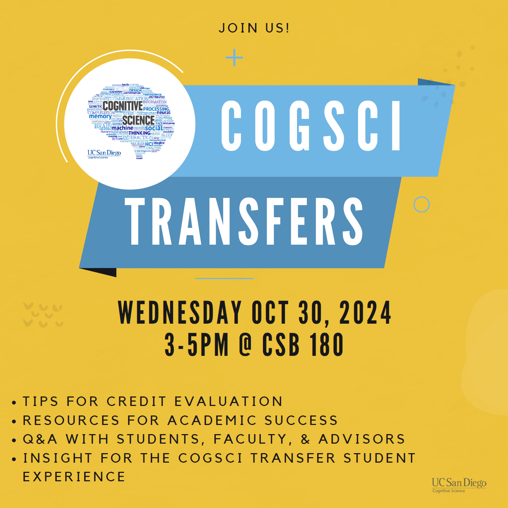
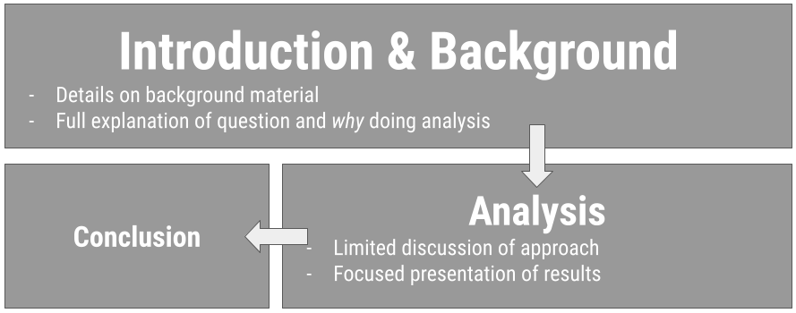
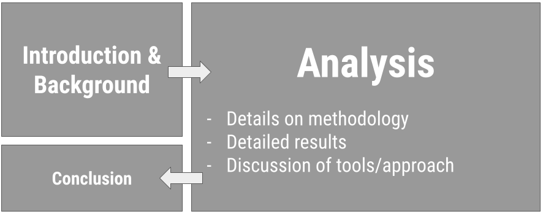
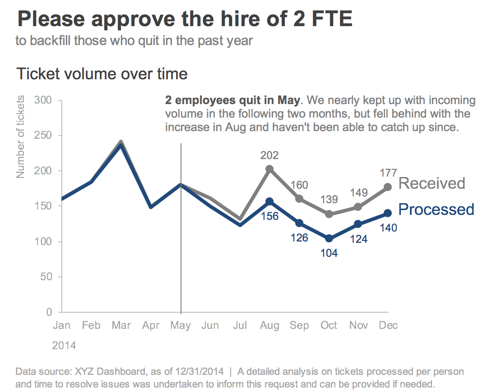
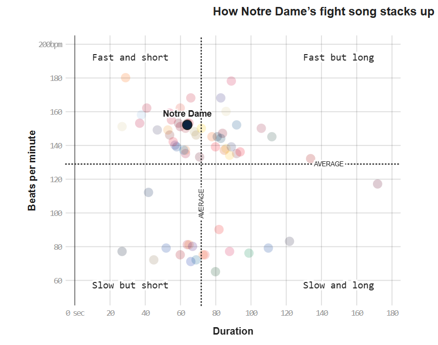
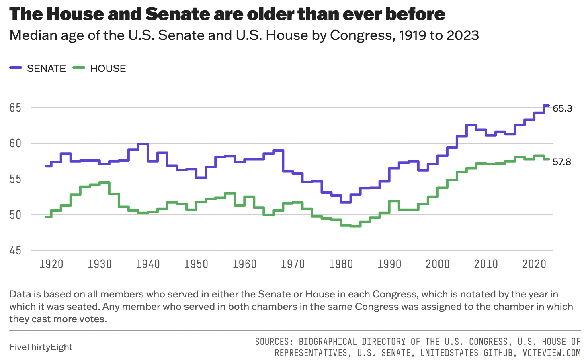
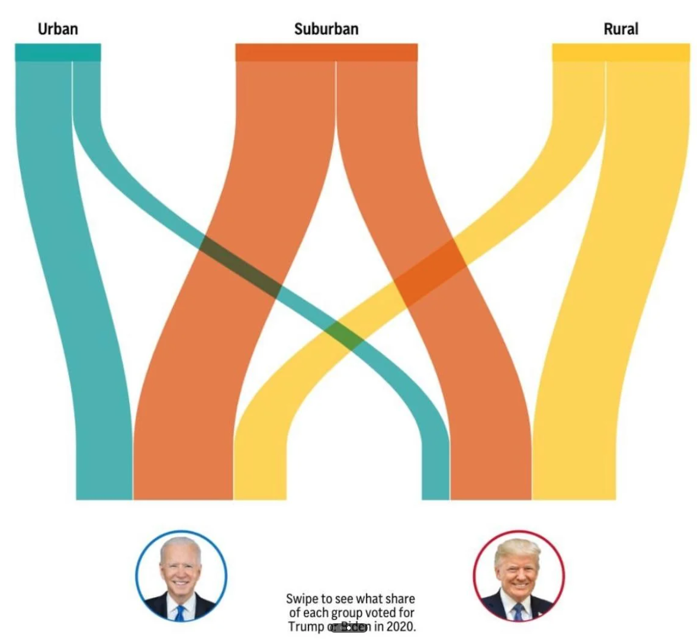
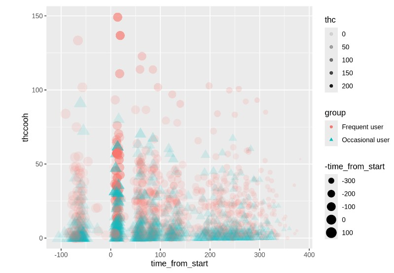

# Effective Written Communication {background-color="#92A86A"}

## Q&A {.scrollable .smaller}

<!-- Copy this box once per question. Put the question after "Q:" in the title and your answer in the body. -->

::: {.callout-note collapse="true" title="Q: "}
A: 
:::

## [ad] CSS Masters Program


About the CSS MS Program: 

UC San Diego's one-year M.S. in Computational Social Science combines coursework approaches and formal models across social science disciplines with modern computational data analysis techniques. With a hands-on curriculum involving a summer bootcamp, core foundational training, in-depth electives across fields, and a portfolio-building capstone project, this program provides substantive and wide-ranging practice applying skill sets to real-world problems preparing graduates for careers in industry, public policy, education, non-profits, or for further academic study in a Ph.D. program. 

## [ad] COGS Transfers



## Course Announcements

**Due Dates**:

-   ⌨️ **Lab 03** due Fri 10/23 (11:59 PM)
-   ⌨️ **Lab 04** due Fri 10/30 (11:59 PM)
-   💻 **CS01** (report in repo + general communication on Canvas) & 🔘 CS01 team eval survey due Fri 10/30 (11:59 PM)
-   🔘 **Mid-course survey** due Fri 10/30 (11:59 PM)
-   🔘 Lecture Participation survey "due" after class

<!-- FA24 announcements, kept for reference:
**Due Dates**:

- `r emo::ji("science")` **Lab 04** due Thursday (11:59 PM)
- `r emo::ji("computer")` **CS01** due Monday (11:59 PM)
- `r emo::ji('clipboard')` Lecture Participation survey "due" after class
- `r emo::ji('computer')` [mid-course survey](https://docs.google.com/forms/d/e/1FAIpQLScYyxJ-UkBMbSabSYtvhmY9NuQwtt4XabIj-OkSHEgRpRrhEA/viewform?usp=sf_link) now available (due Fri at 11:59 PM)

Notes: 

- lab 03 scores and feedback posted; everyone received feedback; check GH issue
- lab 05 is available and the focus this Fri/Mon lab...but not due until after CS01. Best to do it before CS01, as it will help CS01 completion
- Thursday will be semi-guided class time for working on your case study. Communicate with your group to encourage attendance.
-->

```{r packages, echo = FALSE, message=FALSE, warning=FALSE}
library(tidyverse)
library(emo)
library(knitr)
library(kableExtra)
library(googlesheets4)

# ggplot2 color palette with gray
color_palette <- list(gray = "#999999", 
                      salmon = "#E69F00", 
                      lightblue = "#56B4E9", 
                      green = "#009E73", 
                      yellow = "#F0E442", 
                      darkblue = "#0072B2", 
                      red = "#D55E00", 
                      purple = "#CC79A7")

knitr::opts_chunk$set(dpi = 300, echo=TRUE, warning=FALSE, message=FALSE) 
```

## Agenda

-   Communicating for your audience
-   Written Communication
-   Visual Communication

Note: We'll discuss oral communication closer to the end of the quarter, when you'll have to present out loud.

## Suggested Reading

-   Quarto: [Execution Options](https://quarto.org/docs/computations/execution-options.html) (code chunks & inline code)
-   Quarto: [HTML Basics](https://quarto.org/docs/output-formats/html-basics.html) and [HTML Code Blocks](https://quarto.org/docs/output-formats/html-code.html)


# Consider your audience {background-color="#92A86A"}

## What does this mean?

[`r emo::ji("question")` What does it mean to "consider your audience?"]{style="background-color: #ADD8E6"}

. . .

Simply: **You do the work so they don't have to.**

. . .

...also the aesthetic-usability effect exists.

## What's the right level?

::: columns
::: {.column width="50%"}
**General Audience**\
✔ background\
🚫 limit technical details\
🎉 emphasize take-home\


:::

::: {.column width="50%"}
**Technical Audience**\
⬇ limit background\
💻 all-the-details\
🎉 emphasize take-home\


:::
:::

## Considerations

-   **Platform**: written? oral?

. . .

-   **Setting**: informal? formal?

. . .

-   **Timing**: never go over your time limit!

## Choose informative titles

On **presentations**: Balance b/w short and informative (goal: concise)

. . .

::: {.fragment .semi-fade-out}
Avoid: "Analyzing NHANES"
:::

Better: "Data from the NHANES study shows that diet is related to overall health"

. . .

On **visualizations**: emphasize the take-home! (what's learned or what action to take)

. . .

::: {.fragment .semi-fade-out}
Avoid: "Boxplot of gender"
:::

Better: "Twice as many females as males included for analysis"

. . .

::: {.fragment .semi-fade-out}
Avoid: "Tickets vs. Time"
:::

Better: "Staff unable to respond to incoming tickets; need to hire 2 FTEs"


# Effective Written Communication {background-color="#92A86A"}

## Benefits of written communciation

Your audience has time to process...but the explanation has to be there!

. . .

Visually: more on a single visualization

. . .

Yes, often there are different visualizations for reports/papers than for presentations/lectures.

## When you have time to digest (read)



. . .

[`r emo::ji("question")` What makes this an effective visualization for a written communication?"]{style="background-color: #ADD8E6"}

Source: [Storytelling wtih data](https://www.storytellingwithdata.com/book/downloads) by cole nussbaumer knaflic

## Written Explanations

-   Visualizations should be explained/interpreted
-   Analyses/Models should be explained
    -   should be clear what question is being answered
    -   what conclusions is being drawn
    -   and what numbers were used to draw that conclusion

## Data Science Reports in .qmd

:::incremental
-   As **concise** as possible
-   **Important information introduced** before referenced (datasets, jargon, etc.)
-   **Necessary details** (for your audience); nothing more
    -   Be sure that the rendered output contains what you intended (plots displayed; headers etc.)
    -   ...and does NOT display stuff that doesn't need to be there (messages/warnings suppressed, brainstorming, etc.)
-   Typical Sections: Introduction/Background, Setup, Data, Analysis, Conclusion, References
:::

## Controlling HTML document settings

-   Table of Contents

```         
---
title: "Document Title"
format:
  html:
    toc: true
    toc-depth: 3
---
```

. . .

-   Theme

```         
---
title: "Document Title"
format:
  html:
    theme: united
    highlight-style: tango
---
```

. . .

-   Figure Options

```         
---
title: "Document Title"
format:
  html:
    fig-width: 7
    fig-height: 6
---
```

. . .

-   Code Folding

```         
---
title: "Document Title"
format:
  html:
    code-fold: true
---
```

. . .

-   Self-contained HTML (so the file on GitHub displays correctly on its own)

```         
---
title: "Document Title"
format:
  html:
    embed-resources: true
---
```

## Controlling code chunk output {.smaller}

-   Specified at the top of the chunk, one per line, with `#|`

````
```{r}
#| label: chunk-label
#| results: hide
#| fig-height: 4

```
````

. . .

-   `eval`: whether to execute the code chunk
-   `echo`: whether to include the code in the output
-   `warning`, `message`, and `error`: whether to show warnings, messages, or errors in the rendered document
-   `fig-width` and `fig-height`: control the width/height of plots

. . .

-   Controlling for the whole document (in the YAML):

```         
---
title: "Document Title"
execute:
  warning: false
  message: false
---
```

## Editing & Proofreading

-   Did you end up telling a story?
    -   Things missing?
    -   Things to delete?

. . .

-   Do not fall in love with your words/code/plots

. . .

-   Do spell check
-   Do read it over before sending/presenting/submitting

## Aside: Citing Sources {.smaller}

**When are citations needed?**

. . .

::: {.fragment .semi-fade-out}
> "We will be doing our analysis using two different data sets created by two different groups: Donohue and Mustard + Lott, or simply Lott"
:::

. . .

::: {.fragment .semi-fade-out}
> "What turned from the idea of carrying firearms to protect oneself from enemies such as the British monarchy and the unknown frontier of North America has now become a nationwide issue."
:::

. . .

::: {.fragment .semi-fade-out}
> "Right to Carry Laws refer to laws that specify how citizens are allowed to carry concealed handguns when they're away from home without a permit"
:::

. . .

::: {.fragment .semi-fade-out}
> "In this case study, we are examining the relationship between unemployment rate, poverty rate, police staffing, and violent crime rate."
:::

. . .

::: {.fragment .semi-fade-out}
> "In the United States, the second amendment permits the right to bear arms, and this law has not been changed since its creation in 1791."
:::

. . .

::: {.fragment .semi-fade-out}
> "The Right to Carry Laws (RTC) is defined as"a law that specifies if and how citizens are allowed to have a firearm on their person or nearby in public.""
:::

. . .

**Reminder**: You do NOT get docked points for citing others' work. You can be at risk of AI Violation if you don't. **When in doubt, give credit.**

## Footnotes in .qmd

How to specify a footnote in text:

``` {eval="FALSE"}
Here is some body text.[^1]
```

How to include the footnote's reference:

``` {eval="FALSE"}
[^1]: This footnote will appear at the bottom of the page.
```

::: aside
Note: .bib files can be included with BibTeX references using the `bibliography` parameter in your YAML
:::

# Effective Visual Communication {background-color="#92A86A"}

## The *Glamour* of Graphics

-   builds on top of the grammar (*components*) of a graphic
-   considerations for the *design* of a graphic
-   color, typography, layout
-   going from 😬accurate to 😍effective

::: aside
These ideas and slides are all modified from Will Chase's rstudio::conf2020 [slides](https://www.williamrchase.com/slides/assets/player/KeynoteDHTMLPlayer.html)/talk
:::

. . . 

The following example uses the `penguins` dataset from the `palmerpenguins` package (would have to be installed to run these.)

```{r}
library(palmerpenguins)
```

## An Example...

:::panel-tabset

### 😬 Accurate

```{r}


ggplot(penguins, aes(x = species, fill = species)) +
  geom_bar() +
  labs(title = "Count vs. Species") +
  theme(axis.text.x = element_text(angle = 90, vjust = 0.5, hjust = 1))
```


### 😍 Effective

```{r}
ggplot(penguins, aes(y = fct_rev(fct_infreq(species)), fill = species)) +
  geom_bar() +
  geom_text(stat='count', aes(label=after_stat(count)), hjust = 1.5, color = "white", size = 7) +
  scale_x_continuous(expand = c(0, 0)) +
  scale_fill_manual(values = c("#454545", rep("#adadad", 2))) +
  labs(title = "Adelie Penguins are the most common in Antarctica", 
       subtitle = "Frequency of each penguin species studied near Palmer Station, Antarctica") +
  theme_minimal(base_size = 14) +
  theme(axis.text.x = element_blank(),
        plot.title.position = "plot", 
        panel.grid.major = element_blank(), panel.grid.minor = element_blank(),
        axis.title = element_blank(),
        legend.position = "none")
```


### Changes

- Informative Titles
- Left Align Titles
- Borders & Backgrounds: 👎
- Organize & Remove/Lighten as much as possible
- Legends Suck
- Avoid head-tilting


::: callout-note
A reminder that when you're doing EDA, you're going to generate a lot of plots. Don't spend your time making all of them beautiful. Save that for the "editing" portion of your case study. Once you know which are needed to tell your story, add them in.
:::

:::

# HW02 (revisited) · replace with FA26 examples {background-color="#92A86A"}

## Part I: Imitation

## Fight Songs

::: panel-tabset
### Original



### Plot (Sailor)

```{r ref.label="C", echo = FALSE, out.width="100%"}
```

### Code (Sailor)

```{r C, fig.show = "hide"}
fight <- read_csv('data/fight-songs.csv', show_col_types = FALSE)
 
# Calculate avg_duration and avg_bpm across fight songs for classifying
avg_duration <- mean(fight$sec_duration, na.rm = TRUE)
avg_bpm <- mean(fight$bpm, na.rm = TRUE)

# Begin ggplot
ggplot(fight, aes(x = sec_duration, y = bpm)) +
  
  # Making sure Notre Dame is colored and referenced differently 
  geom_point(aes(color = ifelse(school == "Notre Dame", "Notre Dame", factor(school))), size = 5, alpha = 0.5) +
  scale_color_hue() +
  geom_vline(xintercept = avg_duration, linetype = "dotted", color = "black", size = 0.7) +
  geom_hline(yintercept = avg_bpm, linetype = "dotted", color = "black", size = 0.7) +
   annotate("text", x = avg_duration + 5, y = 100, label = "AVERAGE", angle = 90, vjust = -0.5, size = 3.5)  +
  # Adding in my labels for quadrants + AVERAGE
  annotate("text", x = 0, y = avg_bpm + 5, label = "AVERAGE", hjust = -0.5, size = 3.5) +
  annotate("text", x = 30, y = 190, label = "Fast and short", size = 4) +
  annotate("text", x = 130, y = 190, label = "Fast but long", size = 4) +
  annotate("text", x = 30, y = 60, label = "Slow but short", size = 4) +
  annotate("text", x = 130, y = 60, label = "Slow and long", size = 4) +
  geom_point(aes(x = 60, y = 150), color = "black", size = 5) +
  annotate("text", x = 60, y = 150, label = "Notre Dame", vjust = -1.5, fontface = "bold") +
  labs(x = "Duration", y = "Beats per minute") +
  
  # Scale my axis to adjust to match original 
  
  scale_x_continuous(breaks = seq(0, 180, by = 20)) +
  scale_y_continuous(breaks = seq(40, 200, by = 20), limits = c(40, 200)) +
  coord_fixed(ratio = 0.8) +  
  theme_minimal() +
  # Theme adjusting 
  
  theme(
    plot.margin = margin(t = 10, r = 10, b = 10, l = 20),
    legend.position = "none",
    panel.grid.minor = element_line(color = "grey90", linetype = "solid"),
    panel.grid.major = element_line(color = "grey80", linetype = "solid"),
    panel.border = element_rect(color = "black", fill = NA))
```

### Plot (v2)

```{r ref.label="D", echo = FALSE, out.width="100%"}
```

### Code (v2)

```{r D, fig.show = "hide"}
fight_songs_data <- fight
mean_bpm <- mean(fight_songs_data$bpm, na.rm = TRUE)
mean_duration <- mean(fight_songs_data$sec_duration, na.rm = TRUE)

ggplot(fight_songs_data, aes(x = sec_duration, y = bpm)) +
    geom_point(aes(color = school), alpha = 0.2, size = 5) +
    geom_vline(xintercept = mean_duration, linetype = "dotted", color = "black") +
    geom_hline(yintercept = mean_bpm, linetype = "dotted", color = "black") +
    geom_point(data = filter(fight_songs_data, school == "Stanford"), 
               aes(x = sec_duration, y = bpm), 
               color = "red", size = 5, shape = 21, fill = "red") +
    geom_text(data = filter(fight_songs_data, school == "Stanford"), 
              aes(x = sec_duration, y = bpm, label = "Stanford", fontface = "bold", family = "Arial"), 
              vjust = -1, color = "black", size = 4) +
    labs(
        title = "How Stanford's Fight Song stacks up",
        x = "Duration",
        y = "Beats per minute"
    ) +
    scale_y_continuous(breaks = seq(60, 200, by = 20),
                       labels = c("60", "80", "100", "120", "140", "160", "180", "200bpm"),
                       limits = c(60, 200)) +
    scale_x_continuous(breaks = seq(0, 180, by = 20), 
                       labels = c("0 sec", "20", "40", "60", "80", "100", "120", "140", "160", "180")) +
    annotate("text", x = 10, y = 190, label = "Fast and short", size = 4, hjust = 0, family = "Courier") +
    annotate("text", x = 10, y = 70, label = "Slow but short", size = 4, hjust = 0, family = "Courier") +
    annotate("text", x = 140, y = 190, label = "Fast but long", size = 4, hjust = 1, family = "Courier") +
    annotate("text", x = 140, y = 70, label = "Slow and long", size = 4, hjust = 1, family = "Courier") +
    annotate("text", x = max(fight_songs_data$sec_duration) - 20, y = mean_bpm, 
             label = "AVERAGE", vjust = 0.5, hjust = -0.1, color = "black", size = 3, family = "Arial") +
    theme_minimal() +
    theme(
        legend.position = "none",
        plot.title = element_text(hjust = 0.5, face = "bold", family = "Arial"),
        panel.grid.major = element_line(size = 0.5),
        panel.grid.minor = element_blank()
    )
```

:::

## Hate Crimes (Adam)

::: panel-tabset
### Original


### Plot 

```{r ref.label="Adam", echo = FALSE, out.width="100%"}
```

### Code

```{r Adam, fig.show = "hide"}
# Load data
url <- "https://raw.githubusercontent.com/fivethirtyeight/data/master/hate-crimes/hate_crimes.csv"
hate_crimes <- read_csv(url)

states_map <- map_data("state")
hate_crimes <- hate_crimes |>
  mutate(state = tolower(state)) 

map_data <- states_map |>
  left_join(hate_crimes, by = c("region" = "state"))


#Graph Numero Uno

ggplot(map_data, aes(x = long, y = lat, group = group, fill = avg_hatecrimes_per_100k_fbi)) +
  geom_polygon(color = "white") +
  scale_fill_gradient(low = "#ffe4d0", high = "#ba3900", na.value = "gray", name = "Hate Crimes\nper 100k") +
  labs(title = "PRE-ELECTION HATE CRIME RATES POST-ELECTION",
       subtitle = "Average annual hate crimes per 100,000 residents, 2010-15") +
  theme_minimal() +
  theme(    axis.text.x = element_blank(),
    plot.title = element_text(face = 'bold'),
    axis.ticks.x = element_blank(),
    axis.text.y = element_blank(),
    axis.ticks.y = element_blank(),
    axis.title.x = element_blank(),
    axis.title.y = element_blank(),
    panel.grid = element_blank(),
    legend.position = "top", 
    legend.title = element_text(size=6),
    
  ) +
  coord_fixed(1.3) #Unstretch

#Second Graph
ggplot(map_data, aes(x = long, y = lat, group = group, fill = hate_crimes_per_100k_splc)) +
  geom_polygon(color = "white") +
  scale_fill_gradient(low = "#b0e2c8", high = "#006646", na.value = "gray", name = "Hate Crimes\nper 100k") +
  labs(title = "POST-ELECTION HATE CRIME RATES POST-ELECTION",
       subtitle = "Average annual hate crimes per 100,000 residents, 2010-15") +
  theme_minimal() +
  theme(    axis.text.x = element_blank(),
    plot.title = element_text(face = 'bold'),
    axis.ticks.x = element_blank(),
    axis.text.y = element_blank(),
    axis.ticks.y = element_blank(),
    axis.title.x = element_blank(),
    axis.title.y = element_blank(),
    panel.grid = element_blank(),
    legend.position = "top", 
    legend.title = element_text(size=6),
    
  ) +
  coord_fixed(1.3) #Unstretch
```
:::


## Congress Age

::: panel-tabset
### Original



### Plot 

```{r ref.label="Congress", echo = FALSE, out.width="100%"}
```

### Code 

```{r Congress, fig.show = "hide"}
congress_data = read_csv("data/data_aging_congress.csv")

congress_data <- congress_data |>
  mutate(year = as.numeric(format(start_date, "%Y")))  #Extracted year from start_date

#Grouping Congress by session to calculate median age
congress_median_age <- congress_data |>
  group_by(congress, year, chamber) |>
  summarise(median_age = median(age_years, na.rm = TRUE)) |>
  ungroup()

ggplot(congress_median_age, aes(x = year, y = median_age, color = chamber)) +
  geom_step(linewidth = 1) +  
  #Senate
  geom_text(data = congress_median_age |> 
              filter(chamber == "Senate", year == 2023),  
            aes(label = "65.3"), 
            hjust = -0.2, vjust = +0.3, size = 3, color = "black", show.legend = FALSE) + 
  #House
  geom_text(data = congress_median_age |> 
              filter(chamber == "House", year == 2023), 
            aes(label = "57.8"), 
            hjust = -0.2, vjust = -0.5, size = 3, color = "black", show.legend = FALSE) +
  #Titles
  labs(title = "Median Age of the U.S. Senate and House by Congress, 1919 to 2023",
       subtitle = "The House and Senate are older than ever before",
       x = "Year",
       y = "Median Age",
       color = "Chamber") +  
    scale_color_manual(values = c("Senate" = "#5b41d1", "House" = "#55aa5c"))+
  #Scaling both axis
  scale_x_continuous(limits = c(min(congress_median_age$year), max(congress_median_age$year)), breaks = seq(1920, 2020, by =  10)) +
  scale_y_continuous(limits = c(45, NA)) +
  theme_minimal() +  
  theme(plot.title = element_text(face = "bold", size = 14),  
        plot.subtitle = element_text(size = 10),
        axis.title = element_text(size = 12),
        legend.position = "top",
        aspect.ratio = 1/4,
        panel.grid.major.x = element_blank(),
        panel.grid.minor.x = element_blank(),
        panel.grid.minor.y = element_blank())
```
:::

## Part II: Sad Plot


## Votes
::: panel-tabset
### Original



### Plot

```{r ref.label="sad", echo = FALSE, out.width="100%"}
```

### Code

```{r sad, fig.show = "hide"}
# estimate data
d <- data.frame(
  area = rep(c('Rural', 'Suburban', 'Urban'), each = 2),
  voted = rep(c('Biden', 'Trump'), times = 3),
  percentages = c(35, 65, 55, 45, 70, 30)
)

# plot

ggplot(d, aes(x = area, y = percentages, fill = voted)) +
  geom_bar(stat = "identity", position = "dodge") +
  labs(
    title = "Votes for Trump and Biden in 2020 Elecxtion Based on Location",
    x = "Location",
    y = "Percentage of Votes",
    fill = "Candidate"  # Legend title
  ) +
  scale_y_continuous(breaks = seq(0, 100, by = 10), limits = c(0, 80)) +
  theme_minimal() +
  scale_fill_manual(values = c("#0033A0", "#C8102E"))  # Custom colors for groups
```
:::

## CS01 Data (Sandy)

::: panel-tabset
### Original



### Plot

```{r ref.label="cs01", echo = FALSE, out.width="100%"}
```

### Code

```{r cs01, fig.show = "hide"}
WB <- read_csv("data/Blood.csv")

WB <- WB |> 
  mutate(Treatment = fct_recode(Treatment, 
                                "5.9% THC (low dose)" = "5.90%",
                                "13.4% THC (high dose)" = "13.40%"),
         Treatment = fct_relevel(Treatment, "Placebo", "5.9% THC (low dose)"),
         Group = fct_recode(Group,
                            "Frequent User" = "Frequent user",
                            "Occasional User" = "Occasional user")) |> 
  janitor::clean_names() |>
  rename(thcoh = x11_oh_thc,
         thccooh = thc_cooh,
         thccooh_gluc = thc_cooh_gluc,
         thcv = thc_v) |>
  mutate(timepoint = case_when(time_from_start < 0 ~ "pre-smoking",
                               time_from_start > 0 & time_from_start <= 30 ~ "0-30 min",
                               time_from_start > 30 & time_from_start <= 70 ~ "31-70 min",
                               time_from_start > 70 & time_from_start <= 100 ~ "71-100 min",
                               time_from_start > 100 & time_from_start <= 180 ~ "101-180 min",
                               time_from_start > 180 & time_from_start <= 210 ~ "181-210 min",
                               time_from_start > 210 & time_from_start <= 240 ~ "211-240 min",
                               time_from_start > 240 & time_from_start <= 270 ~ "241-270 min",
                               time_from_start > 270 & time_from_start <= 300 ~ "271-300 min",
                               time_from_start > 300 ~ "301+ min"))

WB |>
  ggplot(mapping = aes(x = time_from_start,
                       y = thccooh,
                       color = group)) +
  geom_point(size = 3) +
  labs(x = "Time After Smoking (Minutes)", y = "THCCOOH", 
       title = "Change in THCCOOH Levels After Smoking",
       subtitle = "Levels measured over time for frequent and occasional users",
       color = "Group") +
  theme(plot.title = element_text(size = 20, hjust = 0, vjust = 2),
        plot.subtitle = element_text(size = 16, hjust = 0, vjust = 1)) +
  scale_color_manual(values = c("Frequent User" = "#fc8d59",
                                "Occasional User" = "#91bfdb")) +
  theme_minimal()
```
:::

## Recap {background-color="#92A86A"}

- Tailor communication for setting and audience
- Written communication has benefit of time; limitation of additional explanation
- Can you control your HTML output from a .qmd document?
- Do you know when to cite a source? 
- Can you implement design choices when generating visualizations for communication?