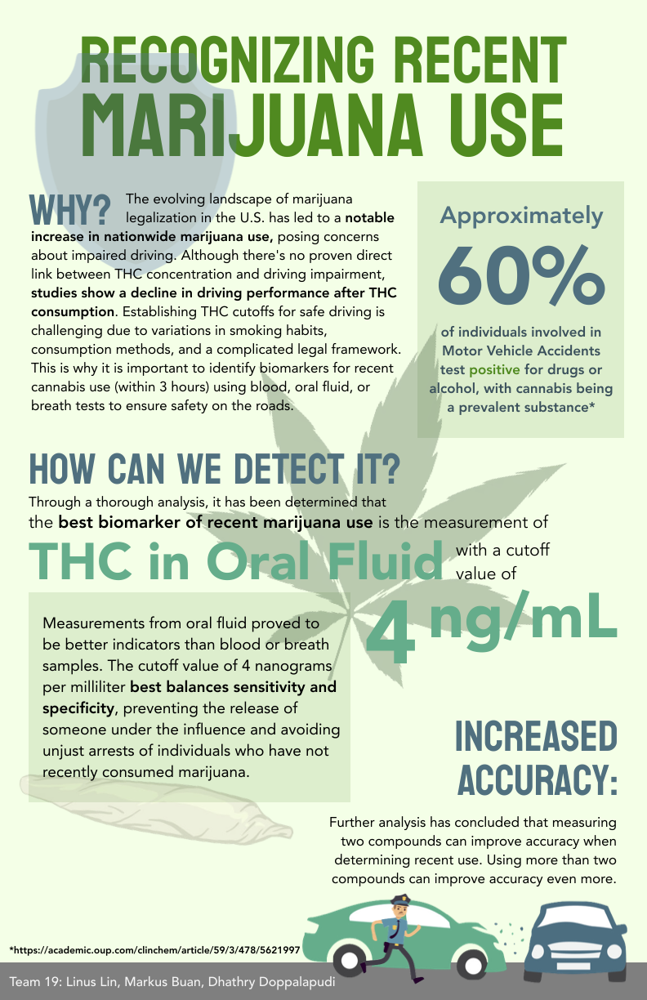
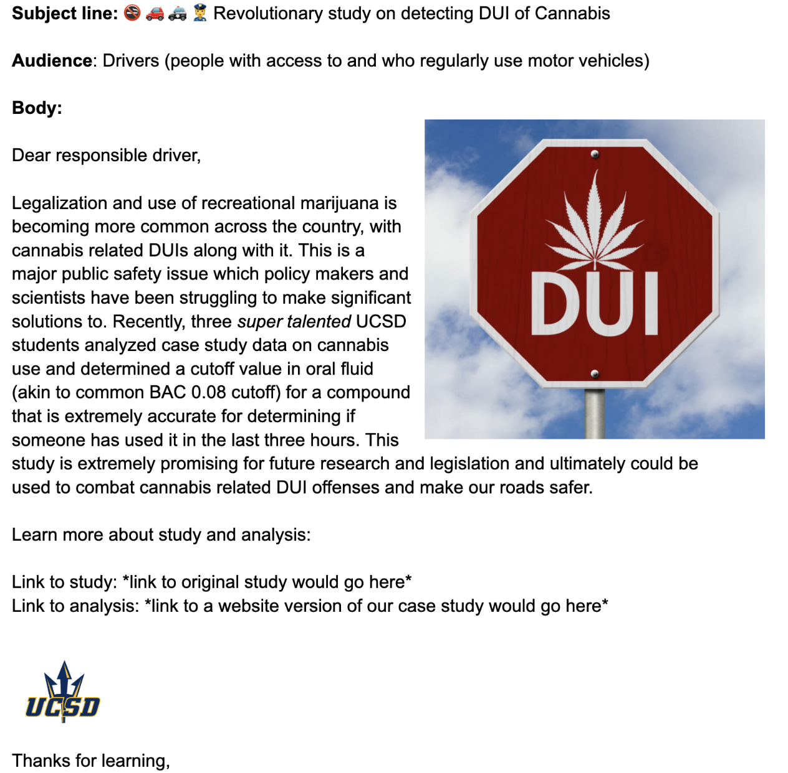

# CS01: In class {background-color="#92A86A"}

## Q&A {.scrollable .smaller}

<!-- Copy this box once per question. Put the question after "Q:" in the title and your answer in the body. -->

::: {.callout-note collapse="true" title="Q: "}
A: 
:::

## Course Announcements

**Due Dates**:

-   ⌨️ **Lab 04** due Fri 10/30 (11:59 PM)
-   💻 **CS01** (report in repo + general communication on Canvas) & 🔘 CS01 team eval survey due Fri 10/30 (11:59 PM)
-   🔘 **Mid-course survey** due Fri 10/30 (11:59 PM)
-   🔘 Lecture Participation survey "due" after class

<!-- FA24 announcements, kept for reference:
**Due Dates**:

-   🔬️ **Lab 04** due tonight (11:59 PM)
-   💻 **CS01** due Monday (11:59 PM)
    -   report (HTML) in repo
    -   general communication - single submission on Canvas
-   🔘 [Lecture Participation survey](https://docs.google.com/forms/d/e/1FAIpQLSebrcx8p0zG5YylzGoCFKRLPVW4wdHoTHIRNc8-YYi_wjleLg/viewform?usp=sf_link) "due" after class
-   🔘 [mid-course survey](https://docs.google.com/forms/d/e/1FAIpQLScYyxJ-UkBMbSabSYtvhmY9NuQwtt4XabIj-OkSHEgRpRrhEA/viewform?usp=sf_link) now available ("due" for EC Fri at 11:59 PM)
-->

## CS01: Questions?

-   group work
-   GH
-   report completion
-   extension
-   ~~general communication~~ (hold these for now)

# General Communication {background-color="#92A86A"}

## Example: infographic

FA23 Group: Dhathry, Markus & Linus

## Example: email

## Example: IG-like slides

Link [here](https://www.canva.com/design/DAF1alZjz2Q/TsnYWt6FBRhD-pjVUh0kuA/view?utm_content=DAF1alZjz2Q&utm_campaign=designshare&utm_medium=link&utm_source=viewer)

## Example: Report



# CS01 Time {background-color="#92A86A"}

## Plan for today

::: incremental
-   Discuss/have a plan
-   Clear on tasks - division of labor; specific deadlines; assignments
-   Make progress & discuss
-   Help one another
-   Recap at end & revisit plan, progress, and who's doing what/when
:::
