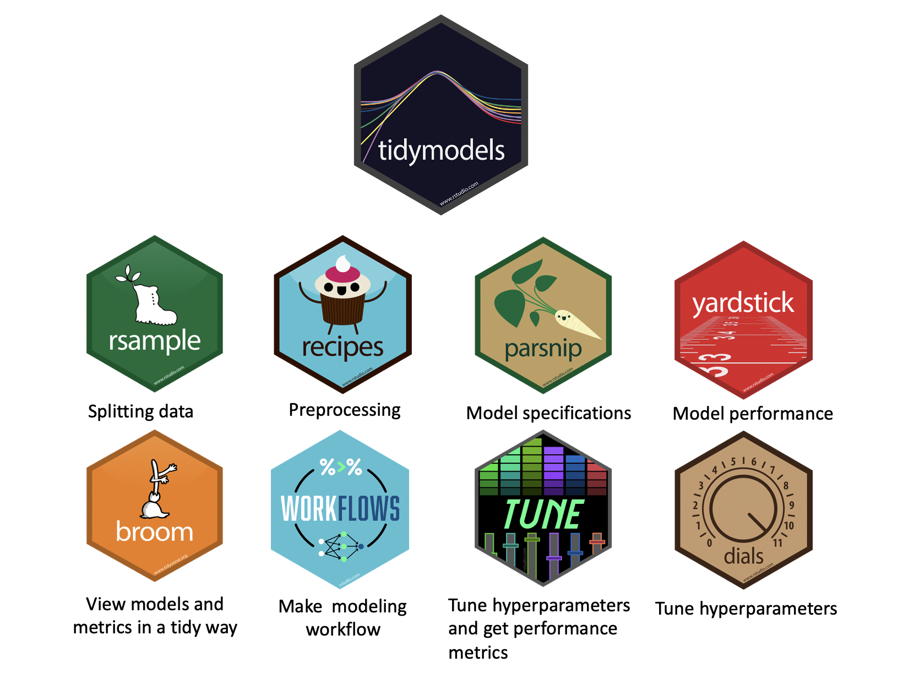
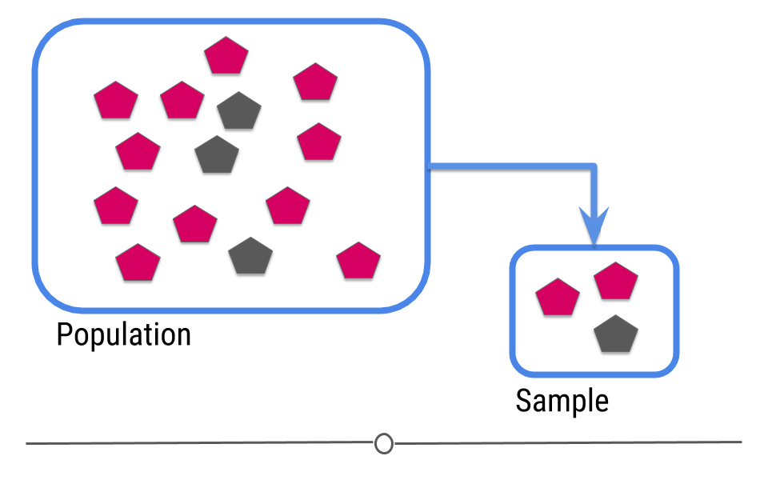
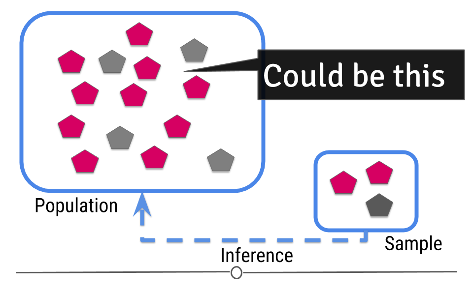
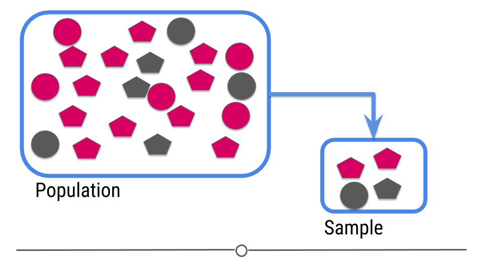
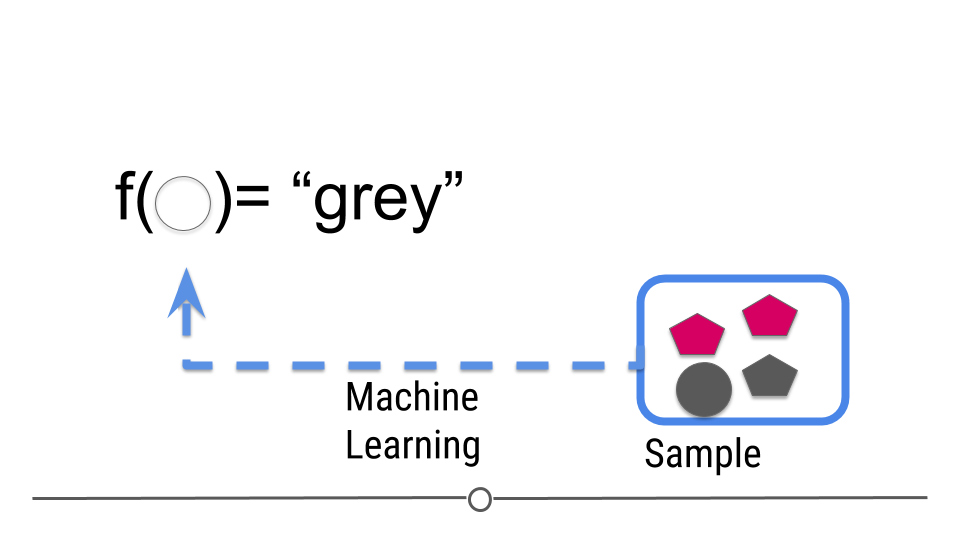
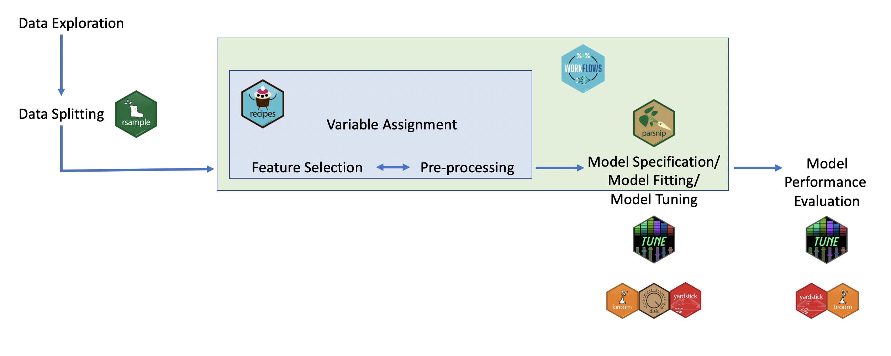

```{r packages, echo = FALSE, message=FALSE, warning=FALSE}
library(tidyverse)

knitr::opts_chunk$set(dpi = 300, echo=TRUE, warning=FALSE, message=FALSE) 
```

# `tidymodels` {background-color="#92A86A"}

## Q&A {.scrollable .smaller}

<!-- Copy this box once per question. Put the question after "Q:" in the title and your answer in the body. -->

::: {.callout-note collapse="true" title="Q: "}
A: 
:::

## Suggested Reading

-   Tidy Modeling with R Chapter 7: [A Model Workflow](https://www.tmwr.org/workflows)
-   The package itself has some worked examples: https://www.tidymodels.org/start/models/

## Course Announcements

**Due Dates**:

-   📄 **Final Project Proposal** due Wed 11/4 (11:59 PM)
-   ⌨️ **Lab 05** due Fri 11/6 (11:59 PM)
-   🔘 Lecture Participation survey "due" after class

<!-- FA24 announcements, kept for reference:
-   📄 [**Final Project Proposal**](https://docs.google.com/forms/d/e/1FAIpQLSfXBztrZuK0CeB8p3YZWr6M37oe16DGazuow7_g9Ulr6AiyXg/viewform?usp=sf_link) due tonight
-   `r emo::ji("science")` **Lab 06** due Thursday
-   `r emo::ji('clipboard')` Lecture Participation survey "due" after class

Note: hw03 now available; due date pushed back to Friday 11/22
-->

## Agenda

- modelling (conceptually)
- `tidymodels`
  - inference
  - machine learning

# Modelling {background-color="#92A86A"}


## 🧠 Discussion

1. What is a model?
1. How are models used in inference? In machine learning? 

## `tidymodels`: philosophy

> "Other packages, such as caret and mlr, help to solve the R model API issue. These packages do a lot of other things too: pre-processing, model tuning, resampling, feature selection, ensembling, and so on. In the tidyverse, we strive to make our packages modular and parsnip is designed only to solve the interface issue. It is not designed to be a drop-in replacement for caret. The tidymodels package collection, which includes parsnip, has other packages for many of these tasks, and they are designed to work together. We are working towards higher-level APIs that can replicate and extend what the current model packages can do." - Max Kuhn (`tidymodels` developer)

. . .

Benefits:

1.  Standardized workflow/format/notation across different types of machine learning algorithms
2.  Can easily modify pre-processing, algorithm choice, and hyper-parameter tuning making optimization easy

## `tidymodels`: ecosystem

The main packages (and their roles):

<p align="center">



</p>

## Inference: intro

In intro stats, you should have learned the central dogma of statistics: we sample from a population



. . .

The data from the sample are used to make an inference about the population:




## Inference: packages

```{r out.width="98%", echo=FALSE}
knitr::include_graphics("images/07/tidymodels.png")
```

## `tidymodels`

Not part of `tidyverse`; load separately
```{r}
# should already be installed for you on datahub
library(tidymodels)
```

## Step 1: Specify model

```{r, eval=FALSE}
linear_reg()
```

## Step 2: Set model fitting *engine*

```{r, eval=FALSE}
linear_reg() |>
  set_engine("lm") # lm: linear model
```

## Step 3: Fit model & estimate parameters

... using **formula syntax**

```{r fit-model, eval=FALSE}
linear_reg() |>
  set_engine("lm") |>
  fit(outcome ~ predictor, data = df)
```

## A closer look at model output

$$\widehat{outcome}_{i} = \beta_0 + \beta_1 \times predictor_{i}$$
. . . 


[🧠   How do we read/interpret this model?]{style="background-color: #ADD8E6"}

## Slope and intercept

$$\widehat{outcome}_{i} = \beta_0 + \beta_1 \times predictor_{i}$$

. . .

-   **Slope:** For each additional unit increase in the predictor, we could expect the outcome, on average, to be higher, by $\beta_1$.

. . .

-   **Intercept:** When the predictor is zero, we would expect the outcome to be $\beta_0$ on average.


## ML: intro

For prediction, we have a similar sampling problem:



. . .

But now we are trying to build a rule that can be used to predict a single observation's value of some characteristic using characteristics of the other observations.



## ML: the goal

The goal is to:

build a machine learning algorithm

. . .

that uses features as input

. . .

and predicts an outcome variable

. . .

in the situation where we do not know the outcome variable.

. . . 

[🧠   Summarize/Evaluate: How is this similar/different from inference?]{style="background-color: #ADD8E6"}


## Classic ML

Typically, you use data where you have both the input and output data to **train** a machine learning algorithm.

. . .

What you need:

::: incremental
1.  A data set to train from.
2.  An algorithm or set of algorithms you can use to try values of $f$.
3.  A distance metric $d$ for measuring how close $Y$ is to $\hat{Y}$.
4.  A definition of what a "good" distance is.
:::

## `tidymodels` for ML

How these packages fit together for carrying out machine learning:



## `tidymodels`: steps


# Recap {background-color="#92A86A"}

- Explain what models are used for
- Describe a problem where inference would be beneficial
- Describe a problem where machine learning would be beneficial
- Describe the goals and overall approach to modelling in `tidymodels`
