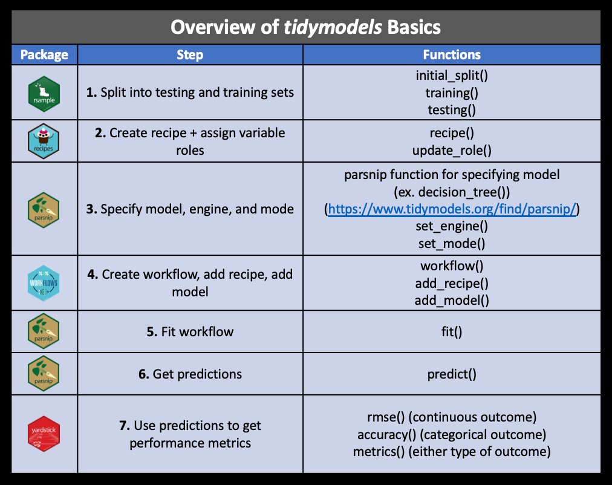
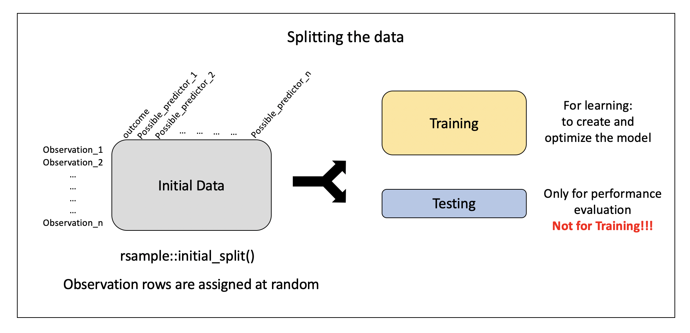
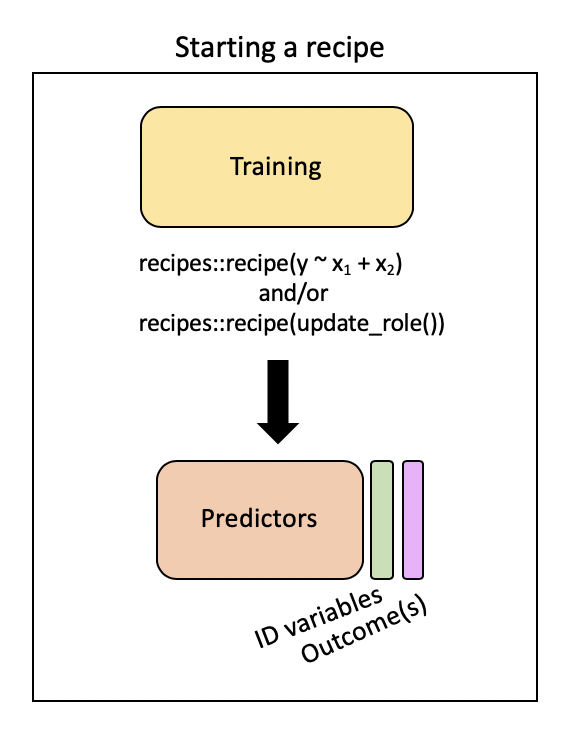
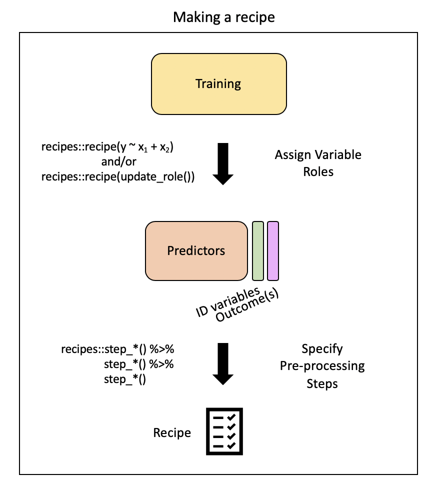
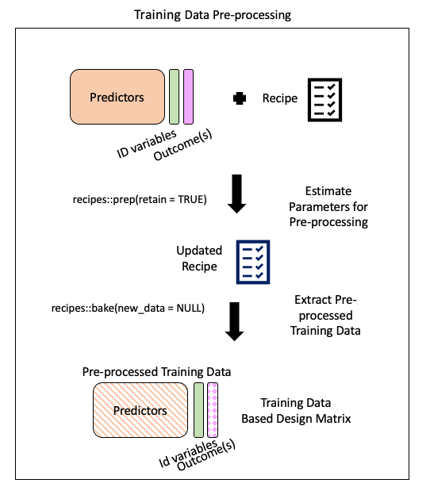
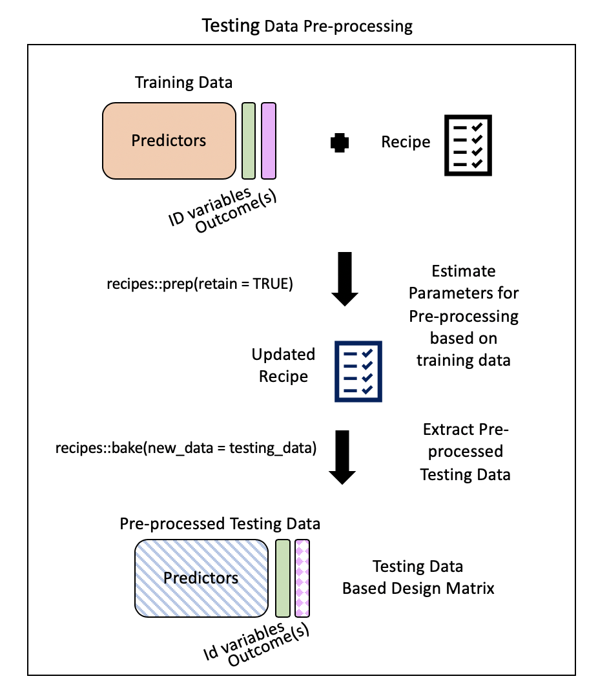
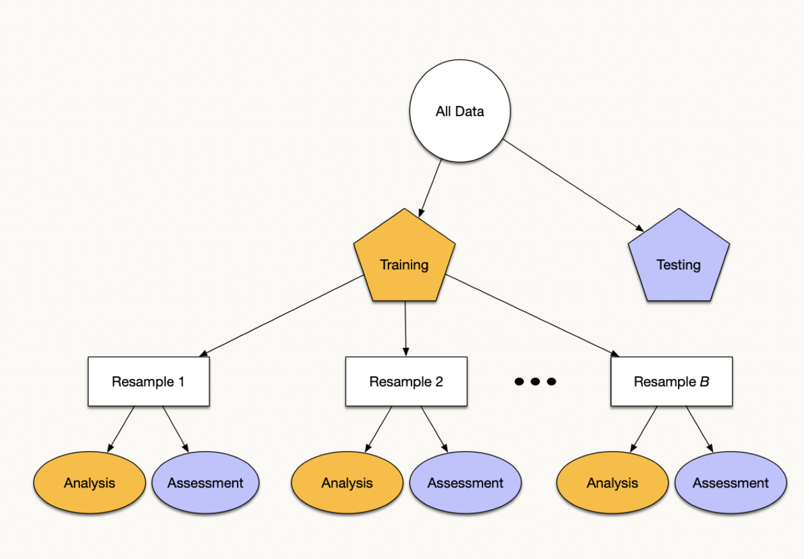
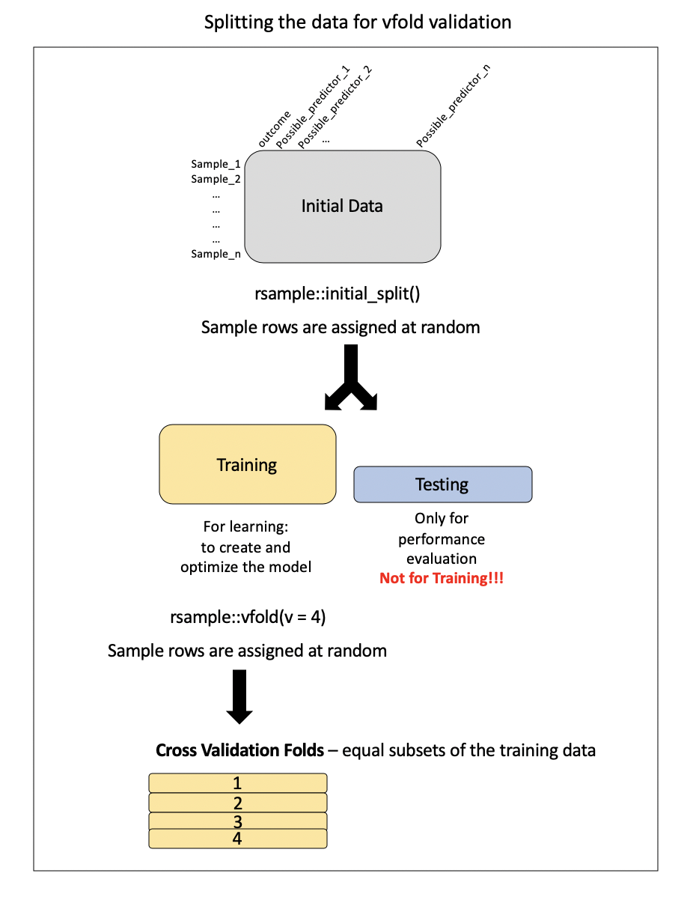
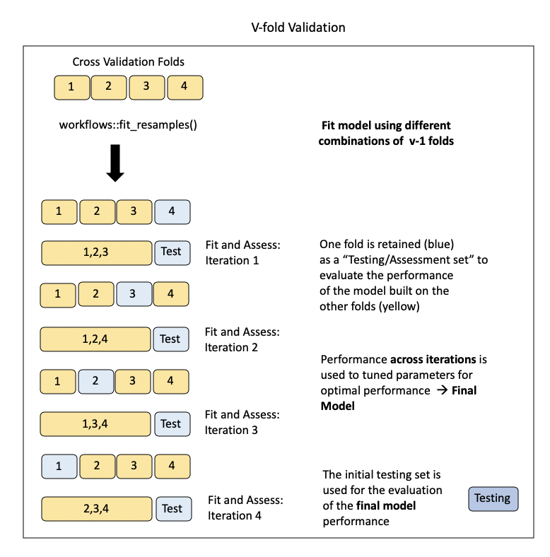

```{r packages, echo = FALSE, warning=FALSE, message=FALSE}
library(tidyverse)
library(tidymodels)
library(emo)

knitr::opts_chunk$set(dpi = 300, echo=TRUE, warning=FALSE) 
```

# CS02: Predicting Air Pollution (Analysis) {background-color="#92A86A"}

## Q&A {.scrollable .smaller}

<!-- Copy this box once per question. Put the question after "Q:" in the title and your answer in the body. -->

::: {.callout-note collapse="true" title="Q: "}
A: 
:::

## Course Announcements

**Due Dates**:

-   ⌨️ **Lab 06** due Fri 11/13 (11:59 PM)
-   ⌨️ **Lab 07** due Fri 11/20 (11:59 PM)
-   🔘 Lecture Participation survey "due" after class

<!-- FA24 announcements, kept for reference:
- **Lab07** due Thursday
- **HW03** due Friday
- **CS02** due Monday
- **Final Project - rough draft** due Monday

Notes: 

- **Lab06** scores/feedback posted
- **CS01** scores/feedback posted
  - Feedback as issue on repo
  - If your score on CS02 is higher than CS01 that score will automatically be used for both CS01 and CS02
- Class Thursday will be time to work on CS02
-->

## Progress Check-in

[`r emo::ji("question")` Where should you and your group be for CSO2 completion?]{style="background-color: #ADD8E6"}

. . . 

[`r emo::ji("question")` Where should you be at right now for your final project? What should you have done for rough draft on Monday?]{style="background-color: #ADD8E6"}


# Question {background-color="#92A86A"}

> With what accuracy can we predict US annual average air pollution concentrations?


# Analysis {background-color="#92A86A"}

## Building our `tidymodels` knowledge:



## The Data

```{r, message=FALSE}
# in your CS02 repo, the file is at "data/pm25_data.csv"
pm <- read_csv("OCS_data/data/raw/pm25_data.csv") |>
  # these are ID codes, not measurements
  mutate(across(c(id, fips, zcta), as.factor))
```

## Data Splitting

<p align="center">



</p>

. . .

Specify the split:

```{r}
set.seed(1234)
pm_split <- rsample::initial_split(data = pm, prop = 2/3)
pm_split
```

-   `set.seed` \<- ensures we all get the exact same random split
-   output displayed: `<training data sample number, testing data sample number, original sample number>`

More on how people decide what proportions to use for data splitting [here](https://onlinelibrary.wiley.com/doi/full/10.1002/sam.11583)


## Split the Data  

```{r}
train_pm <- rsample::training(pm_split)
test_pm <- rsample::testing(pm_split)
 
# Scroll through the output!
count(train_pm, state)
```

[`r emo::ji("question")` What do you observe about the output?]{style="background-color: #ADD8E6"}

## Pre-processing: `recipe()` + `bake()`

Need to:

-   specify predictors vs. outcome
-   scale variables
-   remove redundant variables (feature engineering)

. . .

`recipe` provides a standardized format for a sequence of steps for pre-processing the data

. . .

<p align="center">



</p>

## Step 1: Specify variable roles

The simplest approach...

```{r}
simple_rec <- train_pm |>
  recipes::recipe(value ~ .)

simple_rec
```

. . .

...but we need to specify which column includes ID information

```{r}
simple_rec <- train_pm |>
  recipes::recipe(value ~ .) |>
  recipes::update_role(id, new_role = "id variable")

simple_rec
```

. . .

...and which are our predictors and which is our outcome

```{r}
simple_rec <- recipe(train_pm) |>
    update_role(everything(), new_role = "predictor") |>
    update_role(value, new_role = "outcome") |>
    update_role(id, new_role = "id variable")

simple_rec
```

[`r emo::ji("question")` Can someone summarize what this code is specifying?]{style="background-color: #ADD8E6"}

. . .

Summarizing our recipe thus far:

```{r}
summary(simple_rec)
```

## Step 2: Pre-process with `step*()` 



## Steps {.smaller}

<u>There are step functions for a variety of purposes:</u>

1.  [**Imputation**](https://en.wikipedia.org/wiki/Imputation_(statistics)){target="_blank"} -- filling in missing values based on the existing data
2.  [**Transformation**](https://en.wikipedia.org/wiki/Data_transformation_(statistics)){target="_blank"} -- changing all values of a variable in the same way, typically to make it more normal or easier to interpret
3.  [**Discretization**](https://en.wikipedia.org/wiki/Discretization_of_continuous_features){target="_blank"} -- converting continuous values into discrete or nominal values - binning for example to reduce the number of possible levels (However this is generally not advisable!)
4.  [**Encoding / Creating Dummy Variables**](https://en.wikipedia.org/wiki/Dummy_variable_(statistics)){target="_blank"} -- creating a numeric code for categorical variables ([**More on one-hot and Dummy Variables encoding**](https://medium.com/p/b5840be3c41a/responses/show){target="_blank"})
5.  [**Data type conversions**](https://cran.r-project.org/web/packages/hablar/vignettes/convert.html){target="_blank"} -- which means changing from integer to factor or numeric to date etc.
6.  [**Interaction**](https://statisticsbyjim.com/regression/interaction-effects/){target="_blank"} term addition to the model -- which means that we would be modeling for predictors that would influence the capacity of each other to predict the outcome
7.  [**Normalization**](https://en.wikipedia.org/wiki/Normalization_(statistics)){target="_blank"} -- centering and scaling the data to a similar range of values
8.  [**Dimensionality Reduction/ Signal Extraction**](https://en.wikipedia.org/wiki/Dimensionality_reduction){target="_blank"} -- reducing the space of features or predictors to a smaller set of variables that capture the variation or signal in the original variables (ex. Principal Component Analysis and Independent Component Analysis)
9.  **Filtering** -- filtering options for removing variables (ex. remove variables that are highly correlated to others or remove variables with very little variance and therefore likely little predictive capacity)
10. [**Row operations**](https://tartarus.org/gareth/maths/Linear_Algebra/row_operations.pdf){target="_blank"} -- performing functions on the values within the rows (ex. rearranging, filtering, imputing)
11. **Checking functions** -- Gut checks to look for missing values, to look at the variable classes etc.

**This [link](https://tidymodels.github.io/recipes/reference/index.html){target="_blank"} and this [link](https://cran.r-project.org/web/packages/recipes/recipes.pdf){target="_blank"} show the many options for recipe step functions.**

## Selecting Variables {.smaller}

There are several ways to select what variables to apply steps to:

1.  Using `tidyselect` methods: `contains()`, `matches()`, `starts_with()`, `ends_with()`, `everything()`, `num_range()`\
2.  Using the type: `all_nominal()`, `all_numeric()` , `has_type()`
3.  Using the role: `all_predictors()`, `all_outcomes()`, `has_role()`
4.  Using the name - use the actual name of the variable/variables of interest

## One-hot Encoding

One-hot encoding categorical variables:

```{r}
simple_rec |>
  step_dummy(state, county, city, zcta, one_hot = TRUE)
```

[`r emo::ji("question")` Can anyone explain what one-hot encoding does?]{style="background-color: #ADD8E6"}

. . .

-   `fips` includes numeric code for state and county, so it's another way to specify county
-   so, we'll change `fips`' role
-   we get to decide what to call it (`"county id"`)

```{r}
simple_rec |>
  update_role("fips", new_role = "county id")
```

. . .

Removing variables with near-zero variance:

```{r}
simple_rec |>
  step_nzv(all_predictors(), - CMAQ, - aod)
```

-   specifying to KEEP `CMAQ` and `aod`

. . .

Removing highly correlated variables:

```{r}
simple_rec |>
  step_corr(all_predictors(), - CMAQ, - aod)
```

## Putting our `recipe` together

```{r}
simple_rec <- simple_rec |> 
  update_role("fips", new_role = "county id") |>
  step_dummy(state, county, city, zcta, one_hot = TRUE) |>
  step_nzv(all_predictors(), - CMAQ, - aod) |>
  step_corr(all_predictors(), - CMAQ, - aod)
  
simple_rec
```

Note: order of steps matters. Removing (near-)constant columns *before* computing correlations avoids "the standard deviation is zero" warnings from `step_corr()`.

## Step 3: Running the pre-processing (`prep`) {.smaller}

There are some important arguments to know about:

1.  `training` - you must supply a training data set to estimate parameters for pre-processing operations (recipe steps) - this may already be included in your recipe - as is the case for us
2.  `fresh` - if `fresh=TRUE`, will retrain and estimate parameters for any previous steps that were already prepped if you add more steps to the recipe (default is `FALSE`)
3.  `verbose` - if `verbose=TRUE`, shows the progress as the steps are evaluated and the size of the pre-processed training set (default is `FALSE`)
4.  `retain` - if `retain=TRUE`, then the pre-processed training set will be saved within the recipe (as template). This is good if you are likely to add more steps and do not want to rerun the `prep()` on the previous steps. However this can make the recipe size large. This is necessary if you want to actually look at the pre-processed data (default is `TRUE`)

```{r}
prepped_rec <- prep(simple_rec, 
                    verbose = TRUE, 
                    retain = TRUE )
names(prepped_rec)
```

. . .

This output includes a lot of information:

1.  the `steps` that were run\
2.  the original variable info (`var_info`)\
3.  the updated variable info after pre-processing (`term_info`)
4.  the new `levels` of the variables
5.  the original levels of the variables (`orig_lvls`)
6.  info about the training data set size and completeness (`tr_info`)

## Step 4: Extract pre-processed training data using `bake()` {.smaller}



`bake()`: apply our modeling steps (in this case just pre-processing on the training data) and see what it would do the data

. . .

```{r}
baked_train <- bake(prepped_rec, new_data = NULL)

glimpse(baked_train)
```

-   `new_data = NULL` specifies that we're not (yet) looking at our testing data
-   We only have `r ncol(baked_train)` variables (`r ncol(baked_train) - 3` predictors + 2 id variables + outcome)
-   categorical variables (`state`) are gone (one-hot encoding)
-   `state_California` remains - only state with nonzero variance (largest \# of monitors)

## Step 5: Extract pre-processed testing data using `bake()` {.smaller}

> `bake()` takes a trained recipe and applies the operations to a data set to create a design matrix. For example: it applies the centering to new data sets using these means used to create the recipe. - `tidymodels` documentation

. . .

Typically, you want to avoid using your testing data...but our data set is not that large and NA values in our testing dataset could cause issues later on.

<p align="center">



</p>

. . .

```{r}
baked_test_pm <- recipes::bake(prepped_rec, new_data = test_pm)
glimpse(baked_test_pm)
```

. . .

Hmm....lots of NAs now in `city_Not.in.a.city`

Likely b/c there are cities in our testing dataset that were not in our training dataset...

```{r}
traincities <- train_pm |> distinct(city)
testcities <- test_pm |> distinct(city)

#get the number of cities that were different
dim(dplyr::setdiff(traincities, testcities))

#get the number of cities that overlapped
dim(dplyr::intersect(traincities, testcities))
```

## Aside: return to wrangling

A quick return to wrangling...and re-splitting our data

```{r}
pm <- pm |>
  mutate(city = case_when(city == "Not in a city" ~ "Not in a city",
                          city != "Not in a city" ~ "In a city"))

set.seed(1234) # same seed as before
pm_split <- rsample::initial_split(data = pm, prop = 2/3)
pm_split
train_pm <- rsample::training(pm_split)
test_pm <- rsample::testing(pm_split)
```

-   This recode is a fixed rule that doesn't *learn* anything from the data, so it's OK to do before splitting (unlike, say, filling in missing values with the mean)

. . .

And a recipe update...(putting it all together)

```{r}
novel_rec <- recipe(train_pm) |>
    update_role(everything(), new_role = "predictor") |>
    update_role(value, new_role = "outcome") |>
    update_role(id, new_role = "id variable") |>
    update_role("fips", new_role = "county id") |>
    step_rm(county, zcta) |>
    step_dummy(state, city) |>
    step_nzv(all_predictors()) |>
    step_corr(all_numeric_predictors()) |>
    step_lincomb(all_numeric_predictors())
```

. . .

What changed?

-   `step_rm(county, zcta)`: nearly every monitor has its own county/zip code, so these can't generalize to new monitors (and create new-level problems in the test set)
-   `step_dummy()` without `one_hot`: for linear regression, one-hot encoding adds a redundant column (it's perfectly predictable from the others + the intercept)
-   `all_predictors()`/`all_numeric_predictors()` (not `all_numeric()`): never let a filter step touch the outcome
-   `step_lincomb()`: removes exact linear combinations (e.g., `hs_orless` = `nohs` + `somehs` + `hs`), which `lm()` would otherwise report as `NA`

. . .

re-`bake()`

```{r}
prepped_rec <- prep(novel_rec, verbose = TRUE, retain = TRUE)
baked_train <- bake(prepped_rec, new_data = NULL)
```

. . .

Looking at the output

```{r}
glimpse(baked_train)
```

. . .

Making sure the NA issue is taken are of:

```{r}
baked_test_pm <- bake(prepped_rec, new_data = test_pm)

glimpse(baked_test_pm)
```

## Specifying our model (`parsnip`) {.smaller}

There are four things we need to define about our model:

::: incremental
1.  The **type** of model (using specific functions in parsnip like `rand_forest()`, `logistic_reg()` etc.)\
2.  The package or **engine** that we will use to implement the type of model selected (using the `set_engine()` function)
3.  The **mode** of learning - classification or regression (using the `set_mode()` function)
4.  Any **arguments** necessary for the model/package selected (using the `set_args()`function - for example the `mtry =` argument for random forest which is the number of variables to be used as options for splitting at each tree node)
:::

## Step 1: Specify the model

-   We'll start with linear regression, but move to random forest
-   See [here](https://www.tidymodels.org/find/parsnip/){target="_blank"} for modeling options in `parsnip`.

```{r}
lm_PM_model <- parsnip::linear_reg() |>
  parsnip::set_engine("lm") |>
  set_mode("regression")

lm_PM_model
```

## Step 2: Fit the model

-   `workflows` package allows us to keep track of both our pre-processing steps and our model specification
-   It also allows us to implement fancier optimizations in an automated way and it can also handle post-processing operations.

```{r}
PM_wflow <- workflows::workflow() |>
            workflows::add_recipe(novel_rec) |>
            workflows::add_model(lm_PM_model)
PM_wflow
```

[`r emo::ji("question")` Who can explain the difference between a recipe, baking, and a workflow?]{style="background-color: #ADD8E6"}

## Step 3: Prepare the recipe (estimate the parameters)

```{r}
PM_wflow_fit <- parsnip::fit(PM_wflow, data = train_pm)
PM_wflow_fit
```

## Step 4: Assess model fit

```{r}
wflowoutput <- PM_wflow_fit |> 
  extract_fit_parsnip() |> 
  broom::tidy() 

wflowoutput
```

-   We have fit our model on our training data
-   We have created a model to predict values of air pollution based on the predictors that we have included

. . .

Understanding what variables are most important in our model...

```{r}
PM_wflow_fit |> 
  extract_fit_parsnip() |> 
  vip::vip(num_features = 10)
```

. . .

A closer look at monitors in CA:

```{r}
baked_train |> 
  mutate(state_California = as.factor(state_California)) |>
  mutate(state_California = recode(state_California, 
                                   "0" = "Not California", 
                                   "1" = "California")) |>
  ggplot(aes(x = state_California, y = value)) + 
  geom_boxplot() +
  geom_jitter(width = .05) + 
  xlab("Location of Monitor")
```

. . .

Remember: machine learning (ML) as an optimization problem that tries to minimize the distance between our predicted outcome $\hat{Y} = f(X)$ and actual outcome $Y$ using our features (or predictor variables) $X$ as input to a function $f$ that we want to estimate.

$$d(Y - \hat{Y})$$

. . .

Let's pull out our predicted outcome values $\hat{Y} = f(X)$ from the models we fit (using different approaches).

```{r}
wf_fitted_values <- PM_wflow_fit |>
  augment(new_data = train_pm) |>
  select(value, .fitted = .pred)

head(wf_fitted_values)
```

## Visualizing Model Performance

```{r}
wf_fitted_values |> 
  ggplot(aes(x =  value, y = .fitted)) + 
  geom_point() + 
  xlab("actual outcome values") + 
  ylab("predicted outcome values")
```

[`r emo::ji("question")` What do you notice about/learn from these results?]{style="background-color: #ADD8E6"}

## Quantifying Model Performance {.smaller}

$$RMSE = \sqrt{\frac{\sum_{i=1}^{n}{(\hat{y_t}- y_t)}^2}{n}}$$

. . .

Can use the `yardstick` package using the `rmse`()\` function to calculate:

```{r}
yardstick::metrics(wf_fitted_values,
                   truth = value, estimate = .fitted)
```

-   These are **training** metrics: the model is being graded on the same data it was fit to, so they're optimistic by design
-   $R^2$ suggests the model explains about `r round(100 * yardstick::rsq_vec(wf_fitted_values$value, wf_fitted_values$.fitted))`% of the variance in the training data
-   MAE: on average, predictions are off by about `r round(yardstick::mae_vec(wf_fitted_values$value, wf_fitted_values$.fitted), 2)` µg/m³ (values range from `r round(min(train_pm$value))` to `r round(max(train_pm$value))`)
-   To know how the model does on data it *hasn't* seen, we need cross-validation (next!)

## Day 2 · Mon 11/16 {background-color="#92A86A"}

Cross-validation, random forest & tuning.

## Cross-Validation

Resampling + Re-partitioning:

<p align="center">



</p>

. . .

Preparing the data for cross-validation:

<p align="center">



</p>

Note: this is called v-fold or k-fold CV

## Implementing in `rsample()`

```{r}
set.seed(1234)
vfold_pm <- rsample::vfold_cv(data = train_pm, v = 4)
vfold_pm
```

. . .

```{r}
pull(vfold_pm, splits)
```

. . .

Visualizing this process:

<p align="center">



</p>

## Model Assessment on v-folds

Where this workflow thing really shines...

```{r, message=FALSE, warning=FALSE}
resample_fit <- tune::fit_resamples(PM_wflow, vfold_pm)
```

. . .

Gives us a sense of the RMSE across the four folds:

```{r}
tune::show_best(resample_fit, metric = "rmse")
```

# A different model? {background-color="#92A86A"}

## Random Forest

Fitting a different model...is based on a decision tree:

```{r, echo = FALSE, fig.alt = "Diagram of a single decision tree: the data are split again and again on predictor values until each branch ends in a prediction."}
knitr::include_graphics("https://miro.medium.com/max/1000/1*LMoJmXCsQlciGTEyoSN39g.jpeg")
```

##### [\[source\]](https://towardsdatascience.com/understanding-random-forest-58381e0602d2){target="_blank"}

## But not just one tree...

But...in the case of [random forest](https://towardsdatascience.com/decision-tree-ensembles-bagging-and-boosting-266a8ba60fd9){target="_blank"}:

::: incremental
-   multiple decision trees are created (hence: forest),
-   each tree is built using a random subset of the training data (with replacement) (hence: random)
-   helps to keep the algorithm from overfitting the data
-   The mean of the predictions from each of the trees is used in the final output.
:::

## Visualizing a RF

```{r, echo = FALSE, fig.alt = "Diagram of a random forest: many decision trees, each built on a random sample of the data, whose predictions are combined into one."}
knitr::include_graphics("https://miro.medium.com/max/1400/0*f_qQPFpdofWGLQqc.png")
```

## Updating our `recipe()`

```{r}
RF_rec <- recipe(train_pm) |>
    update_role(everything(), new_role = "predictor")|>
    update_role(value, new_role = "outcome")|>
    update_role(id, new_role = "id variable") |>
    update_role("fips", new_role = "county id") |>
    step_rm(county, zcta) |>
    step_novel(state) |>
    step_string2factor(city) |>
    step_nzv(all_predictors()) |>
    step_corr(all_numeric_predictors())
```

-   can use our categorical data as is (no dummy coding)
-   `county` & `zcta` are still removed: nearly one level per monitor (and `randomForest` can't handle factors with more than 53 levels)
-   `step_novel()`necessary here for the `state` variable to get all cross validation folds to work, (b/c there will be different levels included in each fold test and training sets. The new levels for some of the test sets would otherwise result in an error.; "step_novel creates a specification of a recipe step that will assign a previously unseen factor level to a new value."

## Model Specification

Model parameters:

1.  `mtry` - The number of predictor variables (or features) that will be randomly sampled at each split when creating the tree models. The default number for regression analyses is the number of predictors divided by 3.
2.  `min_n` - The minimum number of data points in a node that are required for the node to be split further.
3.  `trees` - the number of trees in the ensemble

. . .

```{r}
# install.packages("randomForest")
RF_PM_model <- parsnip::rand_forest(mtry = 10, min_n = 3) |> 
  set_engine("randomForest") |>
  set_mode("regression")

RF_PM_model
```

## Workflow

```{r}
RF_wflow <- workflows::workflow() |>
  workflows::add_recipe(RF_rec) |>
  workflows::add_model(RF_PM_model)

RF_wflow
```

## Fit the Data

```{r}
RF_wflow_fit <- parsnip::fit(RF_wflow, data = train_pm)

RF_wflow_fit
```

## Assess Feature Importance

```{r}
RF_wflow_fit |> 
  extract_fit_parsnip() |> 
  vip::vip(num_features = 10)
```

[`r emo::ji("question")` What's your interpretation of these results?]{style="background-color: #ADD8E6"}

## Assess Model Performance

```{r}
set.seed(456)
resample_RF_fit <- tune::fit_resamples(RF_wflow, vfold_pm)
collect_metrics(resample_RF_fit)
```

. . .

For comparison:

```{r}
collect_metrics(resample_fit)
```

[`r emo::ji("question")` Thoughts on which model better achieves our goal?]{style="background-color: #ADD8E6"}

## Model Tuning

[Hyperparameters](https://machinelearningmastery.com/difference-between-a-parameter-and-a-hyperparameter/) are often things that we need to specify about a model. Instead of arbitrarily specifying this, we can try to determine the best option for model performance by a process called tuning.

. . .

Rather than specifying values, we can use `tune()`:

```{r}
tune_RF_model <- rand_forest(mtry = tune(), min_n = tune()) |>
  set_engine("randomForest") |>
  set_mode("regression")
    
tune_RF_model
```

. . .

Create Workflow:

```{r}
RF_tune_wflow <- workflows::workflow() |>
  workflows::add_recipe(RF_rec) |>
  workflows::add_model(tune_RF_model)

RF_tune_wflow
```

Detect how many cores you have access to:

```{r}
# availableCores() respects limits on shared servers like DataHub
# (parallel::detectCores() reports the whole machine)
n_cores <- future::availableCores()
n_cores
```

. . .

This code will take some time to run:

```{r, cache=TRUE, message=FALSE}
# install.packages("future")
# run the tuning in parallel
future::plan("multisession", workers = n_cores)

set.seed(123)
tune_RF_results <- tune_grid(object = RF_tune_wflow, resamples = vfold_pm, grid = 20)
tune_RF_results

# back to running one thing at a time
future::plan("sequential")
```

Note: older guides use `doParallel::registerDoParallel()`; `tune` no longer supports that approach (as of v2.0).

## Check Metrics:

```{r}
tune_RF_results |>
  collect_metrics()
```

. . .

```{r}
show_best(tune_RF_results, metric = "rmse", n = 1)
```

## Final Model Evaluation

```{r}
tuned_RF_values <- select_best(tune_RF_results, metric = "rmse")
tuned_RF_values
```

. . .

The testing data!

```{r}
# specify best combination from tune in workflow
RF_tuned_wflow <- RF_tune_wflow |>
  tune::finalize_workflow(tuned_RF_values)

# fit on ALL the training data, then evaluate ONCE on the test data
overallfit <- RF_tuned_wflow |>
  tune::last_fit(pm_split)

collect_metrics(overallfit)
```

```{r, echo = FALSE}
cv_rmse <- show_best(tune_RF_results, metric = "rmse", n = 1)$mean
test_rmse <- collect_metrics(overallfit) |> filter(.metric == "rmse") |> pull(.estimate)
```

Test RMSE (`r round(test_rmse, 2)`) is similar to the cross-validated RMSE of the tuned model (`r round(cv_rmse, 2)`): CV gave us an honest preview.

. . .

Getting the predictions for the test data:

```{r}
test_predictions <- collect_predictions(overallfit)
```

# Visualizing our results {background-color="#92A86A"}

## A map of the US {.smaller}

Packages needed:

1.  `sf` - the simple features package helps to convert geographical coordinates into `geometry` variables which are useful for making 2D plots
2.  `maps` - this package contains geographical outlines and plotting functions to create plots with maps
3.  `rnaturalearth`- this allows for easy interaction with map data from [Natural Earth](http://www.naturalearthdata.com/) which is a public domain map dataset

```{r, message=FALSE}
library(sf)
library(maps)
library(rnaturalearth)
```

## Outline of the US

```{r}
world <- ne_countries(scale = "medium", returnclass = "sf")
glimpse(world)
```


## World map:

```{r}
ggplot(data = world) +
    geom_sf() 
```

## Just the US

According to this [link](https://en.wikipedia.org/wiki/List_of_extreme_points_of_the_United_States#Westernmost){target="_blank"}, these are the latitude and longitude bounds of the continental US:

-   top = 49.3457868 \# north lat
-   left = -124.7844079 \# west long
-   right = -66.9513812 \# east long
-   bottom = 24.7433195 \# south lat

## Just the US

```{r}
ggplot(data = world) +
    geom_sf() +
    coord_sf(xlim = c(-125, -66), ylim = c(24.5, 50), 
             expand = FALSE)
```

## Monitor Data

Adding in our monitors...

```{r}
ggplot(data = world) +
    geom_sf() +
    coord_sf(xlim = c(-125, -66), ylim = c(24.5, 50), 
             expand = FALSE)+
    geom_point(data = pm, aes(x = lon, y = lat), size = 2, 
               shape = 23, fill = "darkred")
```

## County Lines

Adding in county lines

```{r}
counties <- sf::st_as_sf(maps::map("county", plot = FALSE,
                                   fill = TRUE))

counties
```

## The Map

:::panel-tabset

### Code
```{r fig.show="hide"}
monitors <- ggplot(data = world) +
    geom_sf(data = counties, fill = NA, color = gray(.5))+
      coord_sf(xlim = c(-125, -66), ylim = c(24.5, 50), 
             expand = FALSE) +
    geom_point(data = pm, aes(x = lon, y = lat), size = 2, 
               shape = 23, fill = "darkred") +
    ggtitle("Monitor Locations") +
    theme(axis.title.x=element_blank(),
          axis.text.x = element_blank(),
          axis.ticks.x = element_blank(),
          axis.title.y = element_blank(),
          axis.text.y = element_blank(),
          axis.ticks.y = element_blank())
```

### Plot
```{r, echo=FALSE}
monitors
```

:::

## Counties 

Wrangle counties:

-   separate county and state into separate columns
-   build a matching key from **state + county** (county names repeat across states: 30+ states have a Washington County!)
-   average the monitors within each county (160 counties have more than one)

```{r}
# lower case, letters only, "saint" -> "st", so "St. Lucie" matches "st lucie"
county_key <- function(state, county) {
  county <- county |>
    str_to_lower() |>
    str_remove(":.*") |>            # maps splits some counties into parts
    str_replace("^saint", "st") |>
    str_remove_all("[^a-z]")
  paste(str_to_lower(state), county, sep = ",")
}

counties <- counties |> 
  tidyr::separate(ID, into = c("state", "county"), sep = ",") |> 
  mutate(key = county_key(state, county))

county_truth <- pm |>
  mutate(key = county_key(state, county)) |>
  group_by(key) |>
  summarize(value = mean(value))

map_data <- inner_join(counties, county_truth, by = "key")
```

[`r emo::ji("question")` What would go wrong if we joined on `county` alone?]{style="background-color: #ADD8E6"}

## Map: Truth

::: panel-tabset
### Code

```{r truth, fig.show = "hide"}
truth <- ggplot(data = world) +
  coord_sf(xlim = c(-125,-66),
           ylim = c(24.5, 50),
           expand = FALSE) +
  geom_sf(data = map_data, aes(fill = value)) +
  scale_fill_gradientn(colours = topo.colors(7),
                       na.value = "transparent",
                       breaks = c(0, 10, 20),
                       labels = c(0, 10, 20),
                       limits = c(0, 23.5),
                       name = "PM ug/m3") +
  ggtitle("True PM 2.5 levels") +
  theme(axis.title.x = element_blank(),
        axis.text.x = element_blank(),
        axis.ticks.x = element_blank(),
        axis.title.y = element_blank(),
        axis.text.y = element_blank(),
        axis.ticks.y = element_blank())

```

### Plot

```{r echo = FALSE, warning = FALSE}
truth
```
:::

## Map: Predictions

::: panel-tabset
### Data

Every monitor gets a prediction from a model that **never saw it**:

```{r}
# training monitors: out-of-fold predictions from cross-validation
# (.row = row number in train_pm)
set.seed(456)
cv_preds <- fit_resamples(RF_tuned_wflow, vfold_pm,
                          control = control_resamples(save_pred = TRUE)) |>
  collect_predictions()

train_preds <- train_pm |>
  mutate(.row = row_number()) |>
  inner_join(select(cv_preds, .row, .pred), by = ".row")

# test monitors: predictions from last_fit() (.row = row number in pm)
test_preds <- pm |>
  mutate(.row = row_number()) |>
  inner_join(select(test_predictions, .row, .pred), by = ".row")

# combine and average within county
county_pred <- bind_rows(train_preds, test_preds) |>
  mutate(key = county_key(state, county)) |>
  group_by(key) |>
  summarize(.pred = mean(.pred))
```

Note: *don't* predict the training data with a model fit to the training data (or the test data with a model fit to the test data). Those predictions look great...because the model has already seen the answers.

### Code

```{r pred, fig.show = "hide"}
map_data <- inner_join(counties, county_pred, by = "key")

pred <- ggplot(data = world) +
  coord_sf(xlim = c(-125,-66),
           ylim = c(24.5, 50),
           expand = FALSE) +
  geom_sf(data = map_data, aes(fill = .pred)) +
  scale_fill_gradientn(colours = topo.colors(7),
                       na.value = "transparent",
                       breaks = c(0, 10, 20),
                       labels = c(0, 10, 20),
                       limits = c(0, 23.5),
                       name = "PM ug/m3") +
  ggtitle("Predicted PM 2.5 levels") +
  theme(axis.title.x=element_blank(),
        axis.text.x=element_blank(),
        axis.ticks.x=element_blank(),
        axis.title.y=element_blank(),
        axis.text.y=element_blank(),
        axis.ticks.y=element_blank())
```

### Plot

```{r echo = FALSE, warning = FALSE}
pred
```
:::

## Final Plot

:::panel-tabset

### Code

```{r, fig.show="hide"}
library(patchwork)

final_plot <- (truth/pred) + 
  plot_annotation(title = "Machine Learning Methods Allow for Prediction of Air Pollution", subtitle = paste0("A random forest model predicts annual fine particulate matter (PM 2.5) levels at monitors it was not trained on to within\nabout ", round(test_rmse, 1), " ug/m3 on average (test RMSE), using population density, emissions, and other predictors. Similar methods\ncould help estimate pollution in places with poor monitoring."),
                  theme = theme(plot.title = element_text(size =12, face = "bold"), 
                                plot.subtitle = element_text(size = 8)))
```

### Plot

```{r echo=FALSE}
final_plot
```

[`r emo::ji("question")` What do you learn from these results?]{style="background-color: #ADD8E6"}

## Your Case Study

:::incremental
- Can you copy + paste code directly from here to answer the question? Yes.
- Do you have to present linear regression model *and* random forest? No
- Should you present anything from the 14-regression notes? Probably not. (This is why HW03 and lab07 focus on regression)
- Could you try an additional model as your extension? Yes!
- Does that model have to be "better"? No! But, consider the story!
- Could you try to identify the simplest, accurate model as an extension? Yes.
:::
